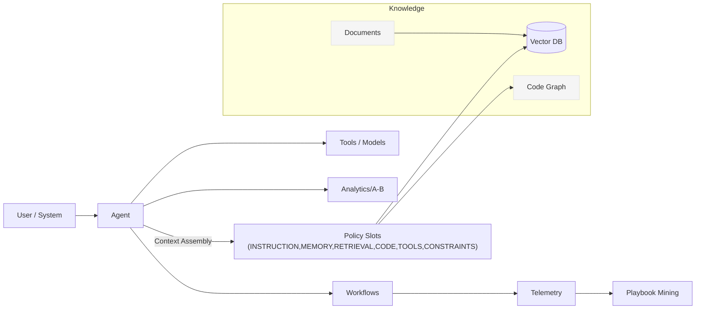

Automatos AI is an orchestration platform that blends **symbolic mechanisms**, **neural fields**, and **quantum semantics** into a practical system for building reliable copilots and automations.

## Why Automatos
- **Mathematical assembly** — `C = A(c₁..c₆)` allocates prompt space across slots (INSTRUCTION, MEMORY, RETRIEVAL, CODE, TOOLS, CONSTRAINTS) with **weights** and **budgets**.
- **Research‑validated ideas** — concepts inspired by IBM Zurich, Princeton ICML (symbolic heads), Indiana University (observer‑dependent semantics), Singapore‑MIT (reasoning‑driven memory consolidation).
- **Production features** — multi‑agent workflows, code graph retrieval, playbook mining, A/B testing, analytics, and tenant‑aware settings.

## Typical Flow
1. **Create agents** with a default **context policy** and tools.  
2. **Index knowledge** (docs + repos) for retrieval and the **code graph**.  
3. **Build workflows** chaining agents and tools.  
4. **Run & monitor**, mine **playbooks**, tune **policies** with **Assembly Preview**.  
5. **Measure** in Analytics + compare via **A/B**.  
6. Govern via **Settings** (tenants, providers, flags, CORS, audit).

## Architecture (high level)

