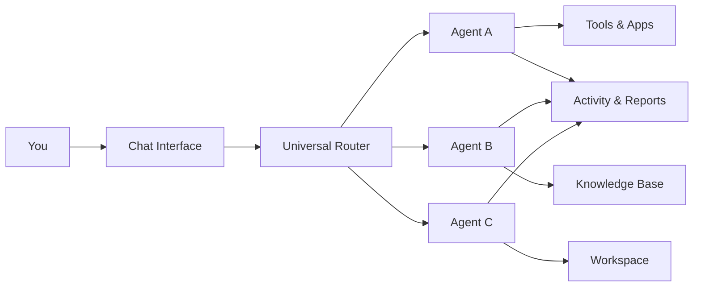

# About Automatos AI

Automatos AI is an open-source multi-agent orchestration platform. It lets you create specialised AI agents, give them tools and knowledge, and coordinate them to handle complex tasks autonomously.

## Core ideas

**Agents are workers, not chatbots.** Each agent has a specific role (Code Reviewer, Sentinel, QA Engineer), its own model configuration, persona, and set of tools. They don't just answer questions — they do work.

**The platform routes, you don't have to.** A multi-tier Universal Router analyses every message and sends it to the best agent automatically. You can override routing or let the system learn from corrections.

**Knowledge powers everything.** Upload documents, sync cloud folders, index code repositories — agents get RAG-powered access to search and reference your data.

**Visibility is built in.** Every agent action, tool call, and LLM request is tracked. See real-time activity, read agent reports, and monitor costs down to the per-request level.

## Architecture at a glance

```mermaid
flowchart LR
  U[You] --> Chat[Chat Interface]
  Chat --> Router[Universal Router]
  Router --> A1[Agent A]
  Router --> A2[Agent B]
  Router --> A3[Agent C]
  A1 --> Tools[Tools & Apps]
  A2 --> KB[Knowledge Base]
  A3 --> Code[Workspace]
  A1 --> Reports[Activity & Reports]
  A2 --> Reports
  A3 --> Reports
```

## Tech stack

| Layer | Technology |
| --- | --- |
| **Frontend** | Next.js 14, TypeScript, Tailwind CSS, shadcn/ui |
| **Backend** | Python, FastAPI, SQLAlchemy, PostgreSQL, Redis |
| **AI** | Multi-provider — OpenRouter, OpenAI, Anthropic, DeepSeek |
| **Storage** | AWS S3 for documents, S3 Vectors for embeddings |
| **Auth** | Clerk with full workspace isolation |
| **Infra** | Docker, Railway |

## Key concepts

| Concept | What it is |
| --- | --- |
| **Agent** | An AI worker with a model, persona, tools, and skills |
| **Workspace** | An isolated environment for a team — agents, data, and config are scoped to it |
| **Playbook** | A multi-step workflow that coordinates multiple agents |
| **Plugin** | A marketplace-distributed package of skills, commands, and agent configs |
| **Skill** | A git-based capability loaded into an agent from a repository |
| **Tool** | An external app integration (GitHub, Slack, Jira) via Composio |
| **Knowledge Base** | A collection of documents indexed for semantic search (RAG) |
| **Universal Router** | The system that automatically sends messages to the right agent |
| **Mission** | An autonomous, multi-step objective that agents plan and execute independently |
| **Channel** | An external messaging platform (Telegram, Slack, WhatsApp) connected to your workspace |
| **Knowledge Graph** | An auto-extracted network of entities and relationships from your documents |
| **Memory** | Persistent agent memory — short-term (session) and long-term (cross-conversation) |
| **Voice Chat** | Speak to agents and hear responses via speech-to-text and text-to-speech |
