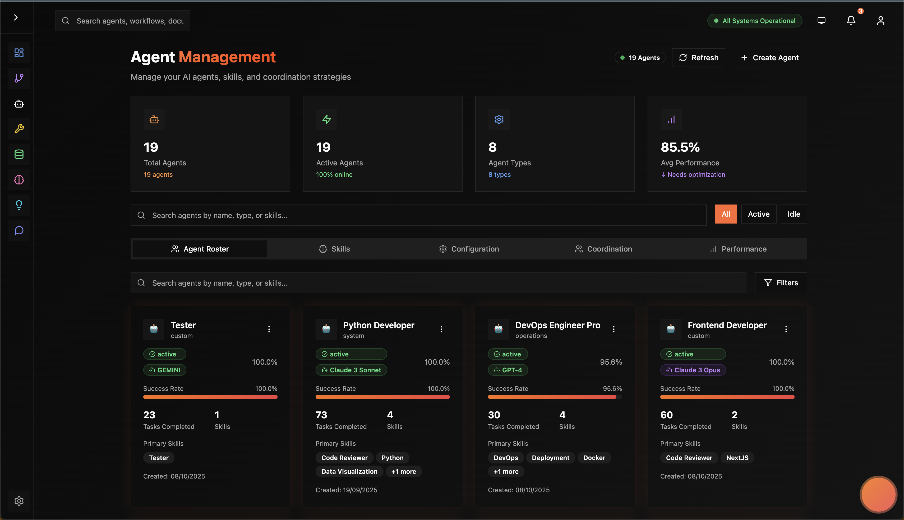
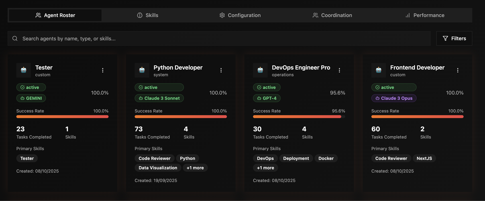
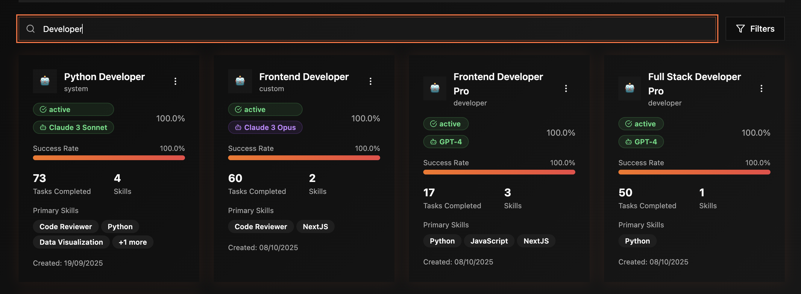
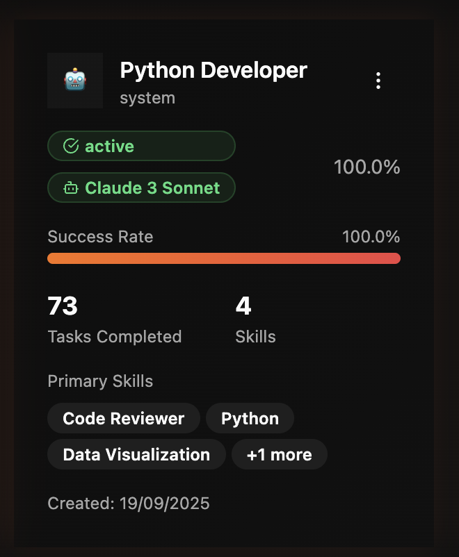
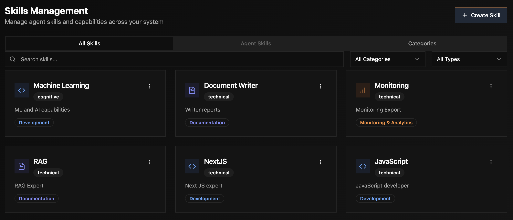
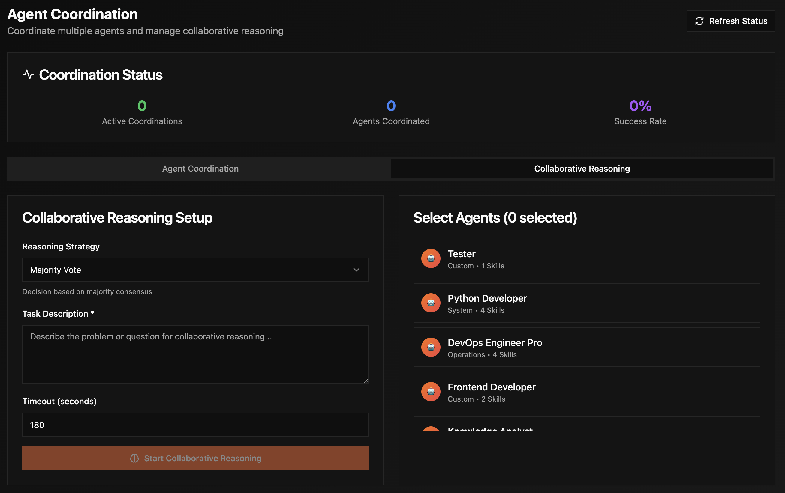
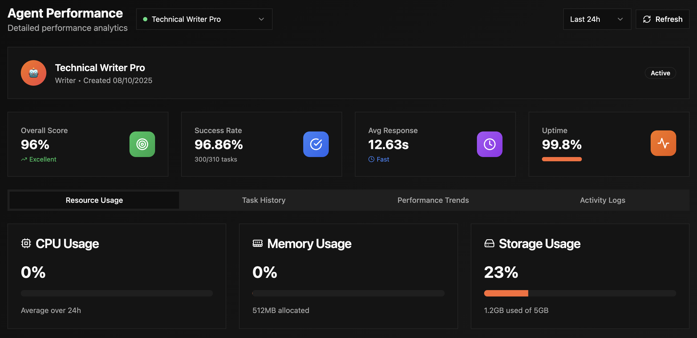

# 🤖 Agent Management Guide

*Master the art of creating and managing specialized AI agents*

---

## 📖 Table of Contents

1. [Overview](#overview)
2. [Quick Start](#quick-start)
3. [Agent Roster Tab](#agent-roster-tab)
4. [Skills Tab](#skills-tab)
5. [Configuration Tab](#configuration-tab)
6. [Coordination Tab](#coordination-tab)
7. [Performance Tab](#performance-tab)
8. [Creating Agents](#creating-agents)
9. [Agent Modals Reference](#agent-modals-reference)
10. [Common Tasks](#common-tasks)
11. [Advanced Features](#advanced-features)
12. [Tips & Best Practices](#tips--best-practices)
13. [Troubleshooting](#troubleshooting)

---

## Overview

### What is Agent Management?

The Agent Management page is your control center for creating, configuring, and monitoring AI agents. Think of agents as specialized AI employees - each with their own expertise, tools, and performance metrics.

**Access**: Navigate to **Agents** from the main sidebar



### What Can You Do Here?

- ✅ **Create specialized agents** with custom models, skills, and tools
- ✅ **Monitor agent performance** with real-time metrics
- ✅ **Configure agent behavior** down to temperature and token limits
- ✅ **Assign skills and tools** for specialized capabilities
- ✅ **Track coordination** between multiple agents
- ✅ **Analyze performance trends** over time

### Page Layout

The Agents page has **5 main tabs**:

1. **👥 Roster** - View and manage all your agents
2. **🧠 Skills** - Browse and assign skills to agents
3. **⚙️ Configuration** - Fine-tune agent settings
4. **🤝 Coordination** - Multi-agent collaboration
5. **📊 Performance** - Metrics and analytics

---

## Quick Start

### Creating Your First Agent (3 Minutes)

**Goal**: Create a Code Review agent in under 3 minutes

**Steps**:

1. Click **"Create Agent"** button (top right)
2. Select **"Code Architect"** template
3. Name it: "Code Reviewer Pro"
4. Choose model: **GPT-4 Turbo**
5. Click **"Create Agent"**

✅ **Done!** Your agent is ready to review code.

**[See detailed walkthrough →](#creating-agents)**

---

## Agent Roster Tab

### Overview

The Roster tab shows all your agents at a glance with key metrics.



### Statistics Cards

At the top, you'll see 4 metric cards:

**📊 Total Agents**  
💡 *Tooltip: "Total number of agents you've created. Each agent is a specialized AI entity."*

- **What it shows**: Count of all agents (active + inactive)
- **Example**: "12 agents"

**⚡ Active Agents**  
💡 *Tooltip: "Agents currently ready to execute tasks. Inactive agents need to be started."*

- **What it shows**: Agents with status = "active"
- **Percentage**: Shows % of total agents that are active
- **Example**: "8 agents (67% online)"

**⚙️ Agent Types**  
💡 *Tooltip: "Different agent specializations (Code Architect, Security Expert, etc.)"*

- **What it shows**: Unique agent type count
- **Example**: "5 types"

**📈 Avg Performance**  
💡 *Tooltip: "Average success rate across all agents based on task completion quality"*

- **What it shows**: Performance score (0-100%)
- **Status**: "Excellent" (>90%), "Needs optimization" (<90%)
- **Example**: "94.2%"


### Search and Filter

**Search Bar**  
💡 *Tooltip: "Search agents by name, type, or description"*

- Type agent name or keywords
- Filters list in real-time
- Case-insensitive

**Status Filter**  
💡 *Tooltip: "Filter agents by their current status"*

- **All**: Show everything
- **Active**: Only running agents
- **Idle**: Agents waiting for tasks
- **Learning**: Agents currently updating knowledge

**Type Filter**  
💡 *Tooltip: "Filter by agent specialization"*

- **All Types**: No filter
- **Code Architect**: Code review, system design
- **Security Expert**: Security audits
- **Data Analyst**: Data analysis
- **Custom**: User-created types



### Agent Cards

Each agent is displayed as a card showing:

**Header**:
- **Agent name** (e.g., "CodeMaster Pro")
- **Status badge**: Active (green), Idle (gray), Busy (yellow), Error (red)
- **Type**: Agent specialization
- **Model**: LLM being used (GPT-4, Claude, etc.)



**Metrics Row**:

💡 *Tooltip: "Quick performance snapshot for this agent"*

- **Tasks**: Total tasks executed
- **Success**: Success rate percentage
- **Quality**: Average quality score
- **Cost**: Total or average cost

**Action Buttons**:

- **View Details**: Opens [Agent Details Modal](#agent-details-modal)
- **Execute Task**: Run a task immediately
- **Edit**: Opens [Agent Configuration Modal](#agent-configuration-modal)
- **⋮ Menu**: More actions (delete, duplicate, export)

### Creating an Agent

Click the **"Create Agent"** button to open the [Create Agent Modal](#create-agent-modal).

---

## Skills Tab

### Overview

The Skills tab manages the expertise and capabilities agents can have.



### Sub-Tabs

The Skills tab has **3 sub-tabs**:

#### 1. All Skills

💡 *Tooltip: "Complete library of available skills. Add these to agents to enhance their capabilities."*

**What it shows**:
- All skills available in the system
- Skill categories (Code Analysis, Security, Data Processing, etc.)
- How many agents have each skill
- Skill descriptions


**Search Skills**:
- Type skill name or category
- Filter by category dropdown
- Results update in real-time

**Skill Cards Show**:
- **Skill Name**: E.g., "Code Analysis"
- **Category**: E.g., "Development"
- **Description**: What the skill does
- **Agent Count**: How many agents have this skill
- **Add to Agent** button: Quick assignment

#### 2. Agent Skills

💡 *Tooltip: "View and manage skills for a specific agent. Add or remove skills to customize agent expertise."*

**What it shows**:
- Skills assigned to the selected agent
- Skill proficiency levels
- When each skill was added
- Quick remove option


**How to Use**:

1. Select an agent from the dropdown
2. View their current skills
3. Click **"Add Skill"** to assign new skills
4. Click **"✕"** to remove a skill

**Skill Proficiency Indicators**:
- **⭐⭐⭐⭐⭐ Expert**: High success rate with this skill
- **⭐⭐⭐⭐ Advanced**: Good performance
- **⭐⭐⭐ Intermediate**: Developing capability
- **⭐⭐ Beginner**: New skill, learning

#### 3. Skill Categories

💡 *Tooltip: "Skills organized by domain. Browse categories to find relevant capabilities."*

**Categories Include**:

- **🔧 Development**: Code analysis, system design, API design, refactoring
- **🛡️ Security**: Security audit, penetration testing, compliance
- **📊 Data**: Data processing, statistics, visualization, ML
- **⚡ Performance**: Performance analysis, optimization, profiling
- **☁️ Cloud**: Cloud architecture, Kubernetes, CI/CD, monitoring


**Using Categories**:
1. Click a category to expand
2. View all skills in that category
3. Click "Add to Agent" on any skill
4. Select target agent from dropdown

### Creating Custom Skills

Click **"Create Skill"** to open the [Create Skill Modal](#create-skill-modal).

---

## Configuration Tab

### Overview

The Configuration tab lets you fine-tune agent behavior and settings.

💡 *Tooltip: "Advanced agent configuration. Modify model settings, resource limits, and behavior parameters."*



### Agent Selector

**Dropdown**: Select which agent to configure

💡 *Tooltip: "Choose an agent to view and modify its configuration"*

- Lists all agents by name
- Shows agent type and status
- Auto-selects first agent on tab load

### Configuration Sections

**Quick Stats Panel**:

Shows current configuration at a glance:
- **Model**: Which LLM (GPT-4, Claude, etc.)
- **Temperature**: Creativity level (0.0-2.0)
- **Max Tokens**: Output limit
- **Skills**: Count of assigned skills
- **Tools**: Count of connected tools


**Edit Configuration Button**:

Opens the [Agent Configuration Modal](#agent-configuration-modal) with 5 detailed tabs.

### Configuration Display

The main area shows read-only view of:

**General Settings**:
- Name, description, agent type
- Status (active/inactive)
- Creation date
- Last updated

**Model Configuration**:
- Provider (OpenAI, Anthropic, HuggingFace)
- Model ID (gpt-4-turbo-preview, claude-3-opus, etc.)
- Temperature setting
- Max tokens
- Fallback model (if configured)

**Skills Assigned**:
- List of all skills with badges
- Skill categories color-coded
- Add/remove skill buttons

**Tools Assigned**:
- Connected MCP tools
- Tool status (active/inactive)
- Permission levels
- Test connection buttons


---

## Coordination Tab

### Overview

The Coordination tab manages multi-agent collaboration and communication.

💡 *Tooltip: "Set up agents to work together on complex tasks. Agents can share knowledge and coordinate actions."*


### Sub-Tabs

#### 1. Agent Coordination

**What it shows**:
- Active agent teams
- Communication patterns between agents
- Shared memory spaces
- Coordination metrics

**Features**:

**Agent Teams Panel**  
💡 *Tooltip: "Groups of agents that work together. Create teams for recurring collaboration patterns."*

- View existing teams
- Create new teams
- Assign agents to teams
- Set team leader (optional)

**Communication Flow**  
💡 *Tooltip: "Visualize how agents communicate during workflow execution"*

- Network graph showing agent connections
- Message frequency indicators
- Communication success rates
- Bottleneck identification


**Shared Context**  
💡 *Tooltip: "Memory and knowledge shared between team members. Enables agents to build on each other's work."*

- View shared memory items
- See knowledge transfer
- Monitor context synchronization

#### 2. Collaborative Reasoning

**What it shows**:
- Multi-agent problem-solving sessions
- Consensus-building results
- Ensemble decision outcomes
- Collaboration quality scores

**Features**:

**Active Collaborations**  
💡 *Tooltip: "Ongoing multi-agent problem-solving sessions"*

- Currently running collaborative sessions
- Participating agents
- Problem being solved
- Progress indicators

**Collaboration History**  
💡 *Tooltip: "Past collaborative sessions with outcomes and lessons learned"*

- Historical collaboration data
- Success rates by agent combination
- Quality improvements from collaboration
- Lessons learned


---

## Performance Tab

### Overview

Track and analyze agent performance with detailed metrics and trends.

💡 *Tooltip: "Monitor agent efficiency, quality, and resource usage. Identify optimization opportunities."*


### Sub-Tabs

The Performance tab has **4 sub-tabs**:

#### 1. Resource Usage

**What it shows**:
- Token consumption over time
- Cost analysis
- Memory utilization
- API call frequency

**Metrics Cards**:

**💰 Total Cost**  
💡 *Tooltip: "Total spend on this agent across all executions. Based on model pricing."*

- Shows total dollars spent
- Cost trend (increasing/decreasing)
- Average cost per task

**🎯 Token Usage**  
💡 *Tooltip: "Tokens are units of text processed by AI models. Lower usage = better efficiency."*

- Total tokens consumed
- Input vs output ratio
- Token efficiency trend

**⏱️ Execution Time**  
💡 *Tooltip: "Average time to complete tasks. Helps identify performance bottlenecks."*

- Average task duration
- Fastest/slowest tasks
- Time trend


**Charts**:

- **Token Usage Over Time**: Line chart showing daily token consumption
- **Cost Breakdown**: Pie chart of costs by task type
- **Efficiency Trend**: Line chart showing tokens per task over time

#### 2. Task History

💡 *Tooltip: "Complete record of all tasks this agent has executed"*

**Task List** shows:

Each task row displays:
- **Task ID**: Unique identifier
- **Description**: What the task was
- **Status**: ✅ Success, ❌ Failed, ⏸️ Paused
- **Quality Score**: 0.0-1.0 rating
- **Duration**: Time taken
- **Tokens**: Tokens used
- **Cost**: Estimated cost
- **Timestamp**: When executed


**Filtering**:
- Filter by status (all/success/failed)
- Filter by date range
- Search by task description
- Sort by any column

**Actions**:
- Click row to see full task details
- Retry failed tasks
- View execution logs
- Download task results

#### 3. Performance Trends

💡 *Tooltip: "Visualize how agent performance changes over time. Identify improvements or degradation."*

**Charts Include**:

**Success Rate Trend**  
Shows success percentage over time (last 7/30/90 days)
- Green line = good trend (improving)
- Red line = concerning trend (declining)
- Target line at 85%

**Quality Score Distribution**  
Histogram showing distribution of quality scores
- Most tasks should be >0.8
- Few tasks should be <0.5
- Normal distribution is healthy

**Execution Time Trend**  
How long tasks take over time
- Downward trend = agent getting faster
- Upward trend = may need optimization



**Token Usage Patterns**  
- Daily token consumption
- Peak usage times
- Efficiency improvements

**Cost Analysis**  
- Daily/weekly/monthly cost trends
- Cost per task type
- Budget vs actual

#### 4. Activity Logs

💡 *Tooltip: "Detailed log of all agent actions. Useful for debugging and auditing."*

**Log Entries Show**:
- **Timestamp**: Exact time
- **Action**: What the agent did
- **Result**: Success/failure
- **Details**: Additional context
- **Duration**: How long it took


**Log Types**:
- **Task Started**: Agent began execution
- **Tool Called**: Agent used an external tool
- **Memory Access**: Agent retrieved/stored memory
- **Communication**: Agent sent/received messages
- **Error**: Something went wrong
- **Learning**: Agent updated knowledge

**Filtering**:
- Filter by log type
- Filter by time range
- Search log messages
- Export logs to CSV

---

## Creating Agents

### Create Agent Modal

Click **"Create Agent"** to open the 4-step wizard.


### Step 1: Agent Type

💡 *Tooltip: "Choose a template or start from scratch. Templates come pre-configured with recommended skills and settings."*

**Template Options**:

**🏗️ Code Architect**
- **Best for**: Code review, system design, refactoring
- **Pre-configured with**: Code analysis, API design, system design skills
- **Recommended model**: GPT-4 Turbo
- **Use cases**: Pull request reviews, architecture planning

**🛡️ Security Expert**
- **Best for**: Security audits, vulnerability scanning, compliance
- **Pre-configured with**: Security audit, OWASP, threat modeling skills
- **Recommended model**: Claude 3 Opus
- **Use cases**: Security reviews, penetration testing

**📊 Data Analyst**
- **Best for**: Data analysis, statistics, insights generation
- **Pre-configured with**: Data processing, statistics, visualization skills
- **Recommended model**: GPT-4
- **Use cases**: Business intelligence, data exploration

**⚡ Performance Optimizer**
- **Best for**: Performance analysis, optimization, scalability
- **Pre-configured with**: Performance analysis, profiling, optimization skills
- **Recommended model**: GPT-4 Turbo
- **Use cases**: Performance reviews, bottleneck identification

**🚀 Infrastructure Manager**
- **Best for**: Cloud infrastructure, DevOps, deployment
- **Pre-configured with**: Cloud architecture, Kubernetes, CI/CD skills
- **Recommended model**: Claude 3 Sonnet
- **Use cases**: Infrastructure planning, deployment automation

**⚙️ Custom Agent**
- **Best for**: Specialized use cases
- **Pre-configured with**: Nothing (you configure everything)
- **Use cases**: Domain-specific agents


**Choosing the Right Template**:

💡 **Beginner Tip**: Start with a template that matches your use case. You can customize everything later.

🔧 **Advanced**: Custom agents give you complete control but require more configuration.

### Step 2: Configuration

**Basic Information**:

**Agent Name** (required)  
💡 *Tooltip: "Give your agent a descriptive name. Examples: 'Python Security Reviewer', 'API Documentation Expert'"*

- Enter a clear, descriptive name
- **Good**: "Code Reviewer - Python Security"
- **Bad**: "Agent 1" or "Test"

**Description** (optional)  
💡 *Tooltip: "Explain what this agent does. Helps team members understand its purpose."*

- Describe the agent's role
- Mention specific use cases
- Note any special configurations

**Agent Type** (pre-filled from Step 1)  
💡 *Tooltip: "Agent specialization. Determines default skills and recommended settings."*

- Auto-filled based on template selection
- Can be changed if needed


**Priority Level**  
💡 *Tooltip: "When multiple agents need resources, higher priority agents execute first."*

- **High**: Critical agents, production tasks
- **Medium**: Standard operations (default)
- **Low**: Background tasks, experimental agents

**Max Concurrent Tasks**  
💡 *Tooltip: "Maximum tasks this agent can handle simultaneously. Higher = more parallel execution."*

- Range: 1-10 tasks
- **Recommended**: 3-5 for most agents
- Higher for simple tasks, lower for complex analyses

**Auto-Start**  
💡 *Tooltip: "Automatically activate this agent when platform starts. Recommended for critical agents."*

- ✅ Enabled: Agent starts automatically
- ❌ Disabled: Manual start required (default)

### Step 3: Model Selection

Choose the AI model that powers your agent.

💡 *Tooltip: "Different models have different strengths. GPT-4 excels at code, Claude excels at analysis."*


**Provider Selection**:

**OpenAI**
- GPT-4 Turbo (best for code, large context)
- GPT-4 (excellent quality, smaller context)
- GPT-3.5 Turbo (fast, cost-effective)

**Anthropic**
- Claude 3 Opus (excellent analysis, 200K context)
- Claude 3 Sonnet (balanced performance)
- Claude 3 Haiku (fast, economical)

**Model Details Card**:

When you select a model, you'll see:

**📊 Model Information**:
- **Display Name**: Human-readable name
- **Model Family**: Model series
- **Provider Badge**: OpenAI/Anthropic/HuggingFace

**📏 Specifications**:
- **Context Window**: How much text it can process (e.g., "128K tokens")
- **Max Output**: Maximum response length (e.g., "4K tokens")

**💰 Costs**:
- **Input Cost**: Price per 1,000 input tokens
- **Output Cost**: Price per 1,000 output tokens
- **Example**: "$0.01/1K input, $0.03/1K output"

**⚡ Capabilities**:
- **Reasoning**: Excellent/Good/Fair
- **Coding**: Excellent/Good/Fair
- **Analysis**: Excellent/Good/Fair

**✨ Features**:
- ✅ Function Calling (can use tools)
- ✅ Streaming (real-time responses)
- ✅ Vision (can understand images) - future feature

**🎯 Recommended For**:
- Code analysis
- Complex reasoning
- System design
- etc.


**Model Configuration**:

**Temperature Slider**  
💡 *Tooltip: "Controls randomness. Lower (0.0-0.5) = focused/consistent. Higher (0.7-2.0) = creative/varied."*

- Range: 0.0 to 2.0
- **0.0-0.3**: Deterministic, consistent (good for code)
- **0.5-0.7**: Balanced (good for most tasks)
- **0.8-1.2**: Creative (good for ideation)
- **1.5-2.0**: Very creative (experimental)

**Max Tokens Slider**  
💡 *Tooltip: "Maximum length of agent responses. Higher = longer responses but more expensive."*

- Range: 100 to 4096 tokens
- **500-1000**: Short responses
- **1500-2500**: Medium responses (recommended)
- **3000-4096**: Long, detailed responses

**Fallback Model** (optional)  
💡 *Tooltip: "Backup model used if primary model fails or hits rate limits. Ensures reliability."*

- Select a cheaper/faster fallback
- Common: GPT-3.5 Turbo as fallback for GPT-4

### Step 4: Skills & Tools

**Skills Selection**:

💡 *Tooltip: "Choose expertise areas for this agent. Skills enhance prompts with domain knowledge."*


**How to Add Skills**:

1. Browse available skills (grouped by category)
2. Click **"+ Add"** next to desired skills
3. Selected skills appear in "Assigned Skills" list
4. Remove by clicking **"✕"** on assigned skills

**Recommended Skills** (based on agent type):
- Shows suggested skills for your template
- Click "Add All Recommended" for quick setup

**Tools Selection**:

💡 *Tooltip: "External integrations this agent can use. Connect GitHub, Slack, databases, and 400+ other tools."*

**Available Tools by Category**:

- **💻 Developer Tools**: GitHub, GitLab, Bitbucket
- **💬 Communication**: Slack, Discord, Email
- **☁️ Cloud**: AWS, Azure, GCP
- **🗄️ Databases**: PostgreSQL, MySQL, MongoDB
- **🔧 Utilities**: File operations, shell commands


**How to Add Tools**:

1. Browse tools by category
2. Check boxes for tools you want
3. Tools appear in "Assigned Tools" list
4. Configure tool permissions (read/write/execute)

⚠️ **Important**: Some tools require credentials to be configured first. See [Credentials Guide](../SETTINGS.md#credentials-tab).

### Review & Create

**Final Review Screen**:

Shows summary of all configurations:
- Agent name and type
- Selected model
- Temperature and token settings
- Assigned skills (count)
- Assigned tools (count)
- Estimated monthly cost (if high usage)


**Buttons**:
- **← Back**: Return to previous step to modify
- **Create Agent**: Finalize creation
- **Save as Template**: Save configuration for reuse

**Creation Process**:

After clicking "Create Agent":

1. **Creating database record...** ✓ (1-2 seconds)
2. **Initializing LLM connection...** ✓ (2-3 seconds)
3. **Loading skills...** ✓ (<1 second)
4. **Connecting tools...** ✓ (1-2 seconds)
5. **Verifying capabilities...** ✓ (1-2 seconds)
6. **Agent ready!** 🎉


**Success**:
- Agent appears in Roster tab
- Status is set to "Active"
- Ready to execute tasks immediately

---

## Agent Modals Reference

### Agent Details Modal

**How to open**: Click "View Details" on any agent card

💡 *Tooltip: "Comprehensive overview of agent status, performance, and capabilities"*


#### Tab 1: Overview

**Displays**:

**Agent Information**:
- Full name and description
- Agent type with icon
- Current status (active/idle/busy)
- Creation date
- Last active timestamp
- Model configuration

**Current Activity**:
- Currently executing task (if any)
- Task progress percentage
- Estimated time remaining
- Cancel task button (if applicable)

**Quick Stats**:
- Total tasks executed
- Success rate
- Average quality score
- Total cost to date

**Assigned Resources**:
- Skills list with proficiency
- Tools list with usage counts
- Memory size (MB)


#### Tab 2: Performance

**Real-time Performance Metrics**:

**Success Rate Chart**  
💡 *Tooltip: "Percentage of tasks completed successfully. Target: >90%"*

- Last 7/30/90 days
- Trend line showing improvement/decline
- Benchmark comparison

**Quality Score Chart**  
💡 *Tooltip: "Average quality rating of agent outputs. Range: 0.0 (poor) to 1.0 (excellent)"*

- Distribution histogram
- Average quality line
- Quality trend over time

**Execution Time Chart**  
💡 *Tooltip: "How long tasks take. Lower is better for efficiency."*

- Average time per task type
- Time trend (getting faster/slower)
- Outlier detection


**Performance Breakdown by Task Type**:

Table showing:
- Task type name
- Count of executions
- Success rate %
- Avg quality score
- Avg duration
- Avg cost

#### Tab 3: Workload

💡 *Tooltip: "Current and historical task load for this agent"*

**Current Workload**:
- **Active Tasks**: Currently executing (with progress)
- **Queued Tasks**: Waiting for execution
- **Capacity**: Used/Total (e.g., "2/5 slots")

**Workload Chart**:
- Tasks over time (hourly/daily)
- Peak usage hours
- Idle time percentage

**Task Queue**:
- List of pending tasks
- Priority order
- Estimated queue time
- Cancel/reorder options


#### Tab 4: Skills

**Skills Management**:

**Assigned Skills List**:
- All skills currently assigned
- Proficiency level for each
- Tasks completed using each skill
- Success rate per skill

**Add Skills Button**:
- Opens skill selector
- Shows available skills not yet assigned
- Add multiple skills at once

**Skill Performance**:
- Chart showing which skills are used most
- Quality scores broken down by skill
- Recommendations for skill additions


**Actions**:
- Remove underperforming skills
- Add complementary skills
- Adjust skill priorities

---

### Agent Configuration Modal

**How to open**: Click "Edit" on agent card, or "Edit Configuration" in Configuration tab

💡 *Tooltip: "Deep configuration of all agent parameters. Advanced users can fine-tune every aspect."*


#### Tab 1: General

**Basic Settings**:

**Name**  
💡 *Tooltip: "Agent display name. Use descriptive names for team clarity."*

**Description**  
💡 *Tooltip: "Explain this agent's purpose and use cases"*

**Agent Type**  
💡 *Tooltip: "Specialization category. Affects default skills and behavior."*

**Status**  
💡 *Tooltip: "Active agents can execute tasks. Inactive agents are disabled."*

- Active / Inactive toggle
- Reason for status (if inactive)


**Metadata**:

**Tags**  
💡 *Tooltip: "Organize agents with tags. Example: 'production', 'experimental', 'python'"*

- Add multiple tags
- Filter/search by tags later
- Suggested tags based on skills

**Created By**  
- Shows who created the agent
- Creation timestamp
- Read-only field

**Last Modified**  
- Last edit timestamp
- Who made the edit
- Change history link

#### Tab 2: Performance

**Execution Settings**:

**Priority Level**  
💡 *Tooltip: "Determines queue position. High priority agents execute before low priority."*

- High / Medium / Low
- Affects resource allocation

**Max Concurrent Tasks**  
💡 *Tooltip: "How many tasks this agent can handle simultaneously"*

- Range: 1-10
- Higher = more parallelism
- Consider model rate limits

**Timeout Settings**  
💡 *Tooltip: "Maximum time allowed for task execution before auto-cancel"*

- Task timeout: 30s to 30 minutes
- Default: 5 minutes
- Adjust based on task complexity


**Retry Settings**:

**Auto-Retry Failed Tasks**  
💡 *Tooltip: "Automatically retry tasks that fail due to temporary errors"*

- Enable/disable toggle
- Max retries: 1-5
- Retry delay: Exponential backoff
- Which errors to retry (timeout, rate limit, etc.)

**Performance Optimization**:

**Caching**  
💡 *Tooltip: "Cache similar task results to save time and cost. Recommended for repetitive tasks."*

- Enable result caching
- Cache duration: 5min to 24 hours
- Similarity threshold for cache hits

#### Tab 3: Resources

**Resource Limits**:

💡 *Tooltip: "Set limits to control costs and prevent runaway executions"*

**Token Budget**:
- **Daily Limit**: Max tokens per day
- **Per Task Limit**: Max tokens per single task
- **Warning Threshold**: Alert when approaching limit


**Cost Budget**:
- **Daily Budget**: Max spend per day (USD)
- **Monthly Budget**: Max spend per month
- **Alert Email**: Who to notify when limit reached

**Memory Limits**:
- **Working Memory**: Max items in active memory (default: 7)
- **Short-term Memory**: Retention period (default: 24 hours)
- **Long-term Memory**: Max storage (MB)

🔧 **Advanced: Rate Limiting**

Configure API rate limits per model:
- Requests per minute
- Requests per hour
- Requests per day
- Concurrent request limit

#### Tab 4: Skills

**Skills Configuration**:

💡 *Tooltip: "Add or remove skills. Each skill enhances the agent's system prompt with domain expertise."*


**Assigned Skills Panel**:

Shows each skill with:
- Skill name and category
- Proficiency level (calculated from performance)
- Usage count
- Remove button

**Add Skills Panel**:

- Browse available skills
- Search by name or category
- Multi-select for batch adding
- Preview skill descriptions

**Skill Ordering**:
- Drag to reorder skills
- Higher priority skills emphasized in prompts
- Affects agent specialization

#### Tab 5: Model

**Model Configuration**:


**Provider & Model**:

💡 *Tooltip: "Select the LLM that powers this agent. See model comparison for guidance."*

- Provider dropdown (OpenAI, Anthropic, HuggingFace)
- Model dropdown (filtered by provider)
- Model details card (same as Step 3)

**Advanced Model Settings**:

🔧 **Advanced**

**Temperature**  
💡 *Tooltip: "Sampling temperature controls randomness in responses"*

- Slider: 0.0 to 2.0
- Decimal precision: 0.1 increments
- Live preview of behavior

**Top P (Nucleus Sampling)**  
💡 *Tooltip: "Alternative to temperature. Limits token selection to top probability mass."*

- Range: 0.0 to 1.0
- Default: 1.0 (disabled)
- Use OR temperature, not both

**Frequency Penalty**  
💡 *Tooltip: "Reduces repetition by penalizing frequently used tokens"*

- Range: -2.0 to 2.0
- Default: 0.0
- Positive values reduce repetition

**Presence Penalty**  
💡 *Tooltip: "Encourages exploring new topics by penalizing tokens already used"*

- Range: -2.0 to 2.0
- Default: 0.0
- Positive values increase topic diversity

**Fallback Model**:
- Secondary model if primary fails
- Auto-selected based on primary
- Can customize

**Model Verification**:
- Test model connection
- Verify API key works
- Check rate limits
- Estimate response time

### Completing Agent Creation

After configuring all steps:

1. Click **"Create Agent"** button
2. Watch progress indicators
3. Wait for verification (5-10 seconds)
4. Success message appears
5. Agent is now in Roster tab


---

### Agent Status Control Modal

**How to open**: Click agent status badge or use "⋮" menu → "Change Status"

💡 *Tooltip: "Control agent lifecycle state. Start, pause, or stop agents as needed."*


**Status Options**:

**🟢 Activate**:
- Makes agent available for tasks
- Agent joins execution pool
- Can receive task assignments

**🟡 Pause**:
- Temporarily disable
- Completes current tasks
- Refuses new tasks
- Preserves all state

**🔴 Deactivate**:
- Fully disable agent
- Stops all current tasks
- Cannot receive assignments
- Good for maintenance

**Status Transition Rules**:
- Active → Pause → Deactivate
- Can't deactivate while tasks running
- Paused agents can be activated directly

**Reason Field**  
💡 *Tooltip: "Note why you're changing status. Helps team understand agent lifecycle."*

- Optional text field
- Example: "Upgrading to new model"
- Logged in agent history

---

### Agent Confirm Delete Modal

**How to open**: Click "⋮" menu → "Delete Agent"

⚠️ **Warning**: Deleting an agent is permanent and cannot be undone.


**Safety Checks**:

Before deletion allowed:
1. ✅ Agent must be inactive (no running tasks)
2. ✅ Type agent name to confirm
3. ✅ Acknowledge data loss warning

**What Gets Deleted**:
- ❌ Agent configuration
- ❌ Performance history
- ❌ Task execution logs
- ❌ Skills assignments
- ❌ Tool connections
- ✅ Memories preserved (optional checkbox)

**Alternatives to Deletion**:

Instead of deleting, consider:
- **Deactivate**: Keep agent but disable
- **Archive**: Move to archived agents (future feature)
- **Export**: Save configuration before deleting

---

### Create Skill Modal

**How to open**: Click "Create Skill" button in Skills tab

💡 *Tooltip: "Define custom skills for domain-specific expertise"*


**Fields**:

**Skill Name** (required)  
💡 *Tooltip: "Descriptive name for the skill. Example: 'Python Security Audit'"*

- Clear, specific names
- Include technology if relevant
- Use title case

**Category** (required)  
💡 *Tooltip: "Organize skills by domain for easy browsing"*

- Select from: Development, Security, Data, Performance, Cloud, Custom
- Affects skill icon and color

**Description** (required)  
💡 *Tooltip: "Explain what this skill does. Used to enhance agent prompts."*

- What expertise does this provide?
- When should agents use it?
- Example use cases

**Prompt Enhancement** (advanced)  
💡 *Tooltip: "Custom prompt text added to agents with this skill. Use to inject domain knowledge."*

🔧 **Advanced**:

```
You are an expert in [domain] with deep knowledge of:
- [Key concept 1]
- [Key concept 2]
- [Key concept 3]

When using this skill, you:
1. [Approach step 1]
2. [Approach step 2]
3. [Approach step 3]
```

**Example Enhancement**:
```
You are an expert in Python security auditing with deep knowledge of:
- OWASP Top 10 vulnerabilities
- Secure coding best practices
- Python-specific security patterns

When reviewing code for security, you:
1. Check for SQL injection risks
2. Validate input sanitization
3. Review authentication/authorization
4. Examine cryptographic implementations
```

---

### Skill Configuration Modal

**How to open**: Click "⚙️" icon on skill card in Skills tab

💡 *Tooltip: "Modify skill parameters and enhancement text"*


**Configurable Settings**:

**Skill Priority**  
💡 *Tooltip: "Higher priority skills are emphasized more in agent prompts"*

- High / Medium / Low
- Affects prompt weighting

**Enable/Disable**  
- Temporarily disable without removing
- Useful for testing skill impact

**Prompt Enhancement**:
- Edit custom prompt text
- Preview how it affects agent
- Save versions for A/B testing

**Performance Tracking**:
- View tasks using this skill
- Success rate with skill
- Quality scores
- Disable if underperforming

---

## Common Tasks

### Task 1: Creating a Code Review Agent

**Scenario**: You want an agent to review Python pull requests

**Steps**:

1. Go to Agents page → Click "Create Agent"
2. **Step 1**: Select "Code Architect" template
3. **Step 2**: 
   - Name: "Python Code Reviewer"
   - Description: "Reviews Python PRs for security and quality"
   - Priority: High
4. **Step 3**:
   - Provider: OpenAI
   - Model: GPT-4 Turbo
   - Temperature: 0.7
   - Max Tokens: 4000
5. **Step 4**:
   - Skills: ✅ Code Analysis, ✅ Security Audit, ✅ Python
   - Tools: ✅ GitHub, ✅ CodeGraph, ✅ File Operations
6. Click "Create Agent"

⏱️ **Time**: 3 minutes  
🎯 **Result**: Agent ready to review PRs

### Task 2: Executing a Task on an Agent

**Scenario**: Test your new agent with a code review

**Steps**:

1. Find your agent in Roster tab
2. Click **"Execute Task"** button
3. **Task Description**: "Review this authentication middleware for security issues"
4. **Add Context** (optional):
   ```json
   {
     "file_path": "middleware/auth.py",
     "focus_areas": ["SQL injection", "authentication bypass"]
   }
   ```
5. Click **"Execute"**
6. Watch real-time progress
7. View results when complete

⏱️ **Time**: 5-30 seconds execution  
🎯 **Result**: Detailed security analysis

### Task 3: Assigning a Tool to an Agent

**Scenario**: Give your agent access to Slack notifications

**Steps**:

1. Select agent in Configuration tab
2. Click **"Edit Configuration"**
3. Go to **Tab 5: Model** (or tools section)
4. Find "Slack" in available tools
5. Click **"+ Add"**
6. Configure Slack credentials (if not set)
7. Set permissions: ✅ Read ✅ Write
8. Click **"Save"**

⏱️ **Time**: 2 minutes  
🎯 **Result**: Agent can now send Slack messages

### Task 4: Monitoring Agent Performance

**Scenario**: Check if your agent is performing well

**Steps**:

1. Go to **Performance tab**
2. Select agent from dropdown
3. Review **Resource Usage**:
   - Is cost within budget?
   - Are tokens reasonable?
4. Check **Task History**:
   - Are most tasks successful?
   - Any patterns in failures?
5. View **Performance Trends**:
   - Is quality improving?
   - Is execution time decreasing?

⏱️ **Time**: 5 minutes  
🎯 **Result**: Understanding of agent health

### Task 5: Improving Agent Quality

**Scenario**: Your agent's quality score is 0.65 (target: >0.8)

**Steps to Improve**:

1. **Add relevant skills**:
   - Go to Configuration → Edit
   - Tab 4: Skills
   - Add missing domain skills

2. **Use better model**:
   - Tab 5: Model
   - Upgrade to GPT-4 (from GPT-3.5)
   - Or Claude 3 Opus for analysis tasks

3. **Increase max tokens**:
   - Tab 2: Performance
   - Increase max tokens (more detailed responses)
   - From 1000 → 2500 tokens

4. **Add more context**:
   - Use CodeGraph tool for code tasks
   - Upload relevant documents to knowledge base
   - Enable RAG for document reference

5. **Monitor improvements**:
   - Check quality scores after changes
   - Compare before/after metrics
   - Fine-tune further as needed

⏱️ **Time**: 10 minutes  
🎯 **Result**: Quality score improvement to >0.8

---

## Advanced Features

### Multi-Agent Teams

🔧 **Advanced**

Create agent teams that work together on complex tasks.

**How to Create a Team**:

1. Go to **Coordination** tab
2. Click **"Create Team"**
3. **Team Name**: "Security Review Team"
4. **Add Agents**:
   - CodeArchitect-001 (lead)
   - SecurityExpert-003 (specialist)
   - DocumentationExpert-005 (documenter)
5. **Configure Collaboration**:
   - Strategy: Hierarchical (lead coordinates)
   - Shared Memory: Enabled
   - Communication: Real-time
6. Click **"Create Team"**

**Using Teams in Workflows**:

When creating workflows, select team instead of individual agents for collaborative execution.

**[See Coordination Tab for details →](#coordination-tab)**

### Agent Memory Management

🔧 **Advanced**

Agents maintain hierarchical memory across sessions.

**Memory Tiers**:

**Working Memory** (Redis, 5 min TTL)  
💡 *Tooltip: "Active task context. Cleared after task completion."*

- Current task details
- Temporary variables
- Capacity: 7 items (Miller's Law)

**Short-term Memory** (PostgreSQL, 24 hours)  
💡 *Tooltip: "Recent experiences and learnings. Consolidated nightly."*

- Recent task executions
- Temporary insights
- Session interactions

**Long-term Memory** (PostgreSQL + pgvector, Permanent)  
💡 *Tooltip: "Consolidated knowledge and learned patterns. Permanent storage."*

- Validated patterns
- Domain knowledge
- Success strategies

**Collective Memory** (Shared, Permanent)  
💡 *Tooltip: "Knowledge shared across all agents in your organization."*

- Cross-agent patterns
- Organizational wisdom
- Best practices

**Viewing Agent Memory**:

1. Open Agent Details Modal
2. Go to Advanced section (if available)
3. View memory statistics
4. Browse memory items
5. Manually add important memories

### Custom Agent Types

🔧 **Advanced**

Developers can create completely custom agent types.

**Requirements**:
- Understanding of agent architecture
- Familiarity with prompting
- Testing capability

**[See Developer Guide for details →](../AGENT_SYSTEM_GUIDE.md#custom-agent-types)**

### Agent Performance Optimization

🔧 **Advanced**

**Optimization Strategies**:

**For Speed**:
- Use GPT-3.5 Turbo or Claude Haiku
- Reduce max tokens
- Enable caching
- Limit tool usage

**For Quality**:
- Use GPT-4 or Claude Opus
- Increase max tokens
- Add more relevant skills
- Enable RAG/CodeGraph

**For Cost**:
- Use cheaper models for simple tasks
- Enable aggressive caching
- Set strict token limits
- Monitor and adjust

**Benchmarking**:

Use Performance tab to:
- Compare agent variations
- A/B test configurations
- Track optimization impact
- Validate improvements

---

## Tips & Best Practices

### Agent Naming

**Good naming patterns**:
- ✅ "Python Security Reviewer"
- ✅ "API Documentation Expert - v2"
- ✅ "CodeReviewer-Prod-001"

**Poor naming patterns**:
- ❌ "Agent 1"
- ❌ "Test"
- ❌ "My Agent"

💡 **Tip**: Include the agent's purpose and technology in the name.

### Model Selection

**Choose model based on task**:

| Task Type | Recommended Model | Why |
|-----------|------------------|-----|
| Code review | GPT-4 Turbo | Excellent code understanding, large context |
| Security audit | Claude 3 Opus | Superior analytical reasoning |
| Data analysis | GPT-4 | Balanced performance |
| Simple tasks | GPT-3.5 Turbo | Fast and cost-effective |
| Documentation | Claude 3 Sonnet | Good at structured writing |

💡 **Tip**: Start with GPT-4 Turbo for most tasks, then optimize based on results.

### Skill Assignment

**Best practices**:
- ✅ Assign 3-7 skills per agent (not too few, not too many)
- ✅ Choose complementary skills (e.g., "Python" + "Security Audit")
- ✅ Avoid redundant skills
- ✅ Remove underused skills after analysis

💡 **Tip**: Check Performance tab to see which skills are actually used.

### Resource Limits

**Recommended limits**:

| Agent Usage | Daily Tokens | Daily Budget |
|-------------|--------------|--------------|
| Light (testing) | 50,000 | $1 |
| Medium (development) | 200,000 | $5 |
| Heavy (production) | 1,000,000 | $25 |

💡 **Tip**: Start conservative, increase based on actual usage.

### Performance Monitoring

**Check weekly**:
- ✅ Success rate (target: >90%)
- ✅ Quality score (target: >0.8)
- ✅ Cost per task (track trends)
- ✅ Execution time (look for increases)

💡 **Tip**: Set up alerts for performance degradation.

---

## Troubleshooting

### Agent Won't Execute Tasks

**Symptom**: Agent shows "idle" but tasks aren't starting

**Solutions**:

1. **Check agent status**:
   - Must be "Active" to receive tasks
   - Go to Roster → Check status badge
   - Activate if needed

2. **Verify model configuration**:
   - Open Configuration tab
   - Click "Edit Configuration"
   - Tab 5: Test model connection
   - Ensure API key is valid

3. **Check resource limits**:
   - Tab 3: Resources
   - Verify not at token/cost limits
   - Increase limits if needed

4. **Review error logs**:
   - Performance tab → Activity Logs
   - Look for error messages
   - Address specific errors

### Low Quality Scores

**Symptom**: Quality scores consistently <0.7

**Solutions**:

1. **Improve model**:
   - Switch to GPT-4 or Claude Opus
   - Increase temperature for creative tasks
   - Decrease for analytical tasks

2. **Add skills**:
   - Review what skills are missing
   - Add domain-specific skills
   - Check skill usage in Performance tab

3. **Provide better context**:
   - Use CodeGraph for code tasks
   - Upload relevant documents
   - Enable RAG retrieval

4. **Check task descriptions**:
   - Are instructions clear?
   - Are examples provided?
   - Is context sufficient?

### High Costs

**Symptom**: Agent costing more than expected

**Solutions**:

1. **Use cheaper model**:
   - GPT-3.5 Turbo instead of GPT-4
   - Claude Haiku instead of Opus

2. **Reduce max tokens**:
   - Lower from 4000 to 2000
   - Shorter responses = lower cost

3. **Enable caching**:
   - Configuration → Tab 2
   - Enable result caching
   - Set appropriate TTL

4. **Limit tool calls**:
   - Remove unnecessary tools
   - Some tools make expensive API calls
   - Monitor tool usage

### Agent Not Appearing in List

**Symptom**: Created agent but don't see it in Roster

**Solutions**:

1. **Refresh the page**: Browser cache may be stale
2. **Check filters**: May be filtered out by status/type
3. **Clear search**: Search bar may be filtering
4. **Check creation success**: Look for success message
5. **View all agents**: Remove all filters

### Model Connection Failed

**Symptom**: "LLM verification error" during creation

**Solutions**:

1. **Check API key**:
   - Go to Settings → Credentials
   - Verify OpenAI/Anthropic API key exists
   - Test connection

2. **Verify key validity**:
   - API key may be expired
   - Regenerate key in provider dashboard
   - Update in Credentials tab

3. **Check rate limits**:
   - You may have hit API rate limits
   - Wait a few minutes
   - Consider rate limit settings

4. **Network issues**:
   - Check internet connection
   - Verify firewall not blocking
   - Test with curl to API endpoint

---

## Related Guides

- **[Workflows Guide](../WORKFLOWS.md)**: Use agents in workflows
- **[Tools Guide](../TOOLS.md)**: Assign tools to agents
- **[Settings Guide](../SETTINGS.md)**: Configure credentials for models
- **[Performance Guide](../ANALYTICS.md)**: Deep analytics on agent performance

---

## Keyboard Shortcuts

💡 **Pro Tip**: Speed up agent management with keyboard shortcuts

- **Ctrl/Cmd + K**: Quick agent search
- **Ctrl/Cmd + N**: Create new agent
- **Ctrl/Cmd + E**: Edit selected agent
- **Ctrl/Cmd + D**: View agent details
- **Tab**: Navigate between tabs
- **Esc**: Close modals

---

## FAQ

### How many agents can I create?

**Unlimited** for most plans. However, each agent:
- Uses tokens when executing (costs money)
- Maintains memory (uses storage)
- Requires model API access

💡 **Recommendation**: Start with 3-10 agents, expand as needed.

### What's the difference between agent types?

Agent types are **templates** with pre-configured skills and recommendations:
- Same underlying system
- Different default skills
- Different recommended models
- Optimized for specific use cases

You can customize any agent regardless of type.

### Can agents learn and improve?

**Yes!** Agents have:
- **Memory systems**: Remember past successes/failures
- **Performance tracking**: Monitor what works
- **Adaptive prompting**: Improve based on feedback
- **Pattern recognition**: Identify successful strategies

Quality typically improves 20-30% over first 100 tasks.

### How do I choose between GPT-4 and Claude?

**General guidance**:

| Criteria | GPT-4 | Claude 3 Opus |
|----------|-------|---------------|
| **Code tasks** | ⭐⭐⭐⭐⭐ Better | ⭐⭐⭐⭐ Good |
| **Analysis** | ⭐⭐⭐⭐ Good | ⭐⭐⭐⭐⭐ Better |
| **Speed** | ⭐⭐⭐⭐ Fast | ⭐⭐⭐ Moderate |
| **Context** | 128K tokens | 200K tokens |
| **Cost** | $$ | $$$ |

💡 **Tip**: Use GPT-4 Turbo as default, switch to Claude for complex analysis.

### Can multiple agents work together?

**Yes!** Use the Coordination tab to:
- Create agent teams
- Enable shared memory
- Configure collaboration strategies
- Monitor team performance

**[See Coordination Tab for details →](#coordination-tab)**

### What happens if an agent fails?

Depends on configuration:

**With Auto-Retry Enabled**:
1. Agent retries automatically (up to configured max)
2. Uses exponential backoff (waits longer each retry)
3. Marks as failed if all retries exhausted
4. Logs error for review

**Without Auto-Retry**:
1. Task marked as failed immediately
2. Error logged
3. Notification sent (if configured)
4. Manual retry available

**[Configure retry settings →](#agent-configuration-modal)**

---

## Glossary

**Agent**: An AI entity that executes tasks using an LLM, skills, and tools

**Model**: The underlying LLM (GPT-4, Claude, etc.) that powers the agent

**Skills**: Areas of expertise that enhance agent capabilities

**Tools**: External integrations the agent can use (GitHub, Slack, etc.)

**Temperature**: Controls randomness in responses (0=focused, 2=creative)

**Tokens**: Units of text processed by AI models (1 token ≈ 4 characters)

**Quality Score**: Rating of task output quality (0.0-1.0)

**Working Memory**: Temporary memory during task execution

**Long-term Memory**: Permanent knowledge and learned patterns

---

**Next**: [Workflows Guide →](../WORKFLOWS.md)

*Master workflows to orchestrate multi-agent automation*


---

## API Reference

**API**  
> **Authentication**  
> All API calls require headers:  
> ```http
> X-API-Key: <your_key>
> Authorization: Bearer <your_token>
> ```

- `POST /api/agents`  
```json
{ "name":"Code Assistant","policy_id":"code_assistant","tools":["search","exec"],"limits":{"max_tokens":4096,"budget_usd":5} }
```

## Edit / Delete
Update policy/tools/limits or remove unused agents.

**API**  
- `GET /api/agents` (list)  
- `GET /api/agents/{id}` (detail)  
- `PUT /api/agents/{id}` (update)  
- `DELETE /api/agents/{id}` (delete)

## Runs
Inspect recent runs for a given agent.

**API**  
`GET /api/runs?agent_id={id}&limit=50`

## Tips
- Start with a conservative **budget**.  
- Keep tool lists minimal per agent to reduce ambiguity.
