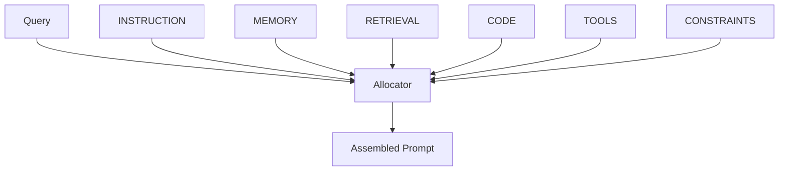

Define how prompts are assembled via **Policies** with explicit slots, weights, and budgets.

## Policy Editor
Slots:
- **INSTRUCTION** — system guidance
- **MEMORY** — episodic/semantic summaries
- **RETRIEVAL** — top‑k doc chunks
- **CODE** — code graph prompt block
- **TOOLS** — tool schemata/examples
- **CONSTRAINTS** — output format/guardrails

**API**  
> **Authentication**  
> All API calls require headers:  
> ```http
> X-API-Key: <your_key>
> Authorization: Bearer <your_token>
> ```

- `GET /api/policy/{policy_id}?tenant_id=`  
- `PUT /api/policy/{policy_id}` (body: `{"policy": ContextPolicy}`)

## Assembly Preview
Paste a query → see the final prompt and per‑slot stats.

**API**  
`POST /api/policy/{policy_id}/assemble`  
```json
{ "q":"How do I paginate?", "slot_values":{"CODE":"// function listItems(page) Ellipsis"} }
```

## Allocation Diagram

