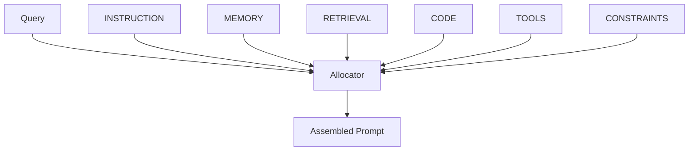

# 🧠 Context Engineering Guide

*Optimize AI performance through intelligent context management*

---

## 📖 Table of Contents

1. [Overview](#overview)
2. [Quick Start](#quick-start)
3. [Performance Tab](#performance-tab)
4. [Query Analysis Tab](#query-analysis-tab)
5. [Patterns Tab](#patterns-tab)
6. [Optimization Tab](#optimization-tab)
7. [RAG Context Tab](#rag-context-tab)
8. [Common Tasks](#common-tasks)
9. [Advanced Features](#advanced-features)
10. [Troubleshooting](#troubleshooting)

---

## Overview

### What is Context Engineering?

Context Engineering is the science of optimizing what information is provided to AI models. Better context = better results at lower cost.

**Access**: Navigate to **Context Engineering** from the sidebar


### Why Context Engineering Matters

**Without optimization** ❌:
- Dump all documents into prompt
- Exceed token limits
- High costs
- Poor quality (information overload)

**With optimization** ✅:
- Select most relevant information
- Stay within token budgets
- Lower costs (-24% average)
- Higher quality (+31% average)

### Key Metrics

| Metric | Target | Your System |
|--------|--------|-------------|
| **Avg Latency** | <1000ms | 987ms 🟢 |
| **Success Rate** | >90% | 94.3% 🟢 |
| **Cache Hit Rate** | >60% | 73% 🟢 |
| **Information Density** | >0.75 | 0.87 🟢 |

### Page Layout

The Context Engineering page has **5 main tabs**:

1. **📊 Performance** - Real-time metrics and trends
2. **🔍 Query Analysis** - Recent queries and results
3. **📋 Patterns** - RAG configurations
4. **⚡ Optimization** - Recommendations for improvement
5. **🛠️ RAG Context** - Interactive context builder

---

## Quick Start

### Test Context Engineering (3 Minutes)

**Goal**: Try semantic search and see RAG in action

**Steps**:

1. Go to **RAG Context** tab
2. Enter query: "How to prevent SQL injection?"
3. Click **"Search"**
4. Watch pipeline execute:
   - Search (0.5s)
   - Diversity optimization (0.2s)
   - Token budget allocation (0.1s)
5. See results with relevance scores
6. View generated context preview

⏱️ **Time**: 30 seconds  
🎯 **Result**: Understanding of RAG process

**[See detailed walkthrough →](#rag-context-tab)**

---

## Performance Tab

### Overview

Monitor context engineering performance in real-time.

💡 *Tooltip: "Track how well the context system is performing. Identify optimization opportunities."*


### Key Metrics Cards

**🔍 Context Queries**  
💡 *Tooltip: "Total number of context/RAG queries executed. Higher = more agent activity."*

- Total queries (all-time)
- Queries this week
- Trend indicator
- Example: "1,247 queries"

**✅ Retrieval Success**  
💡 *Tooltip: "Percentage of queries that returned relevant results. Target: >90%"*

- Success rate percentage
- Failed queries count
- Comparison to last period
- Example: "94.3%"

**⏱️ Avg Response Time**  
💡 *Tooltip: "Average time to retrieve and optimize context. Lower = faster agent execution."*

- Average latency in milliseconds
- Target: <1000ms
- Trend: improving/degrading
- Example: "987ms"

**💾 Vector Embeddings**  
💡 *Tooltip: "Total embeddings in vector database. Each chunk has an embedding for semantic search."*

- Total embedding count
- Storage size
- Growth rate
- Example: "15,234 embeddings"


### Performance Charts

**Query Volume Over Time**  
💡 *Tooltip: "Queries per hour/day. Helps understand system load patterns."*

- Line chart showing query volume
- Last 24 hours / 7 days / 30 days
- Peak hours highlighted
- Helps capacity planning

**Latency Distribution**  
💡 *Tooltip: "How fast are queries? Most should be <1 second."*

- Histogram of query response times
- P50, P95, P99 percentiles shown
- Outlier detection
- Performance trends

**Success Rate Trend**  
💡 *Tooltip: "Query success rate over time. Should be stable around 90-95%."*

- Success percentage over time
- Failures highlighted
- Rolling average line
- Target threshold line


**Cache Performance**  
💡 *Tooltip: "Cache hits save time and money by reusing previous results"*

- Cache hit rate (percentage)
- Cache size (MB)
- Cache evictions
- Most cached queries

---

## Query Analysis Tab

### Overview

Analyze recent context queries with detailed breakdowns.

💡 *Tooltip: "See what agents are searching for and how well it's working"*


### Recent Queries List

Each query shows:

**Query Card**:

- **🔍 Query Text**: What was searched
- **👤 Agent**: Which agent made the query
- **⏱️ Timestamp**: When query executed
- **📊 Confidence**: Result confidence score (0-100%)
- **📁 Sources**: Number of chunks retrieved
- **⌛ Latency**: Response time
- **🏷️ Category**: Query type (Semantic Search, RAG Query, Code Search)


**Status Indicators**:
- 🟢 **High Confidence** (>85%): Excellent results
- 🟡 **Medium Confidence** (60-85%): Good results
- 🔴 **Low Confidence** (<60%): Poor results, may need refinement

**Click query to expand details**:

**Expanded Query Details**:

- **Full Query Text**: Complete query
- **Retrieved Chunks**: All chunks found with similarity scores
- **Optimization Applied**: MMR, knapsack, etc.
- **Token Count**: Tokens in final context
- **Cost**: Estimated cost for this query
- **Execution Time Breakdown**:
  - Embedding generation: Xms
  - Vector search: Xms
  - Diversity optimization: Xms
  - Budget optimization: Xms
  - Total: Xms


### Query Filters

**Time Range**  
💡 *Tooltip: "Filter queries by recency"*

- Last hour
- Last 24 hours
- Last 7 days
- Custom range

**Agent Filter**  
💡 *Tooltip: "Show queries from specific agent"*

- Select agent from dropdown
- See what that agent searches for

**Confidence Filter**  
💡 *Tooltip: "Filter by result quality"*

- All queries
- High confidence only (>85%)
- Medium confidence (60-85%)
- Low confidence (<60%) - needs attention

**Category Filter**:
- All categories
- Semantic Search
- RAG Query
- Code Search
- Memory Retrieval

### Query Insights

**Patterns Detected**  
💡 *Tooltip: "System detects common query patterns and suggests optimizations"*

- Most common query topics
- Queries with no results
- Slow queries (>2 seconds)
- High-cost queries (>5000 tokens)

**Recommendations**:
- "Upload documents about 'deployment' - many queries, few results"
- "Consider caching queries about 'authentication' - searched 23 times"
- "Optimize queries from SecurityExpert-003 - averaging 2.3s latency"


---

## Patterns Tab

### Overview

Manage RAG (Retrieval-Augmented Generation) configurations.

💡 *Tooltip: "RAG configs control how documents are retrieved and optimized. Different strategies for different use cases."*


### RAG Configuration Cards

Each configuration shows:

**Config Info**:
- **Name**: Configuration identifier
- **Status**: 🟢 Active or 🔴 Inactive
- **Retrieval Method**: How documents are found
  - Cosine similarity (default)
  - Euclidean distance
  - Dot product
  - Re-ranking
- **Top K**: Number of chunks to retrieve

**Performance Stats**:
- **Usage**: How many queries used this config
- **Accuracy**: Success rate with this config
- **Avg Latency**: Response time
- **Avg Sources**: Chunks per query


**Actions**:
- **⚙️ Configure**: Open [Configure RAG Modal](#configure-rag-modal)
- **📊 View Stats**: Detailed performance analytics
- **📋 Duplicate**: Copy config to create variation
- **🗑️ Delete**: Remove configuration

### Default Configurations

**Standard RAG** (default)  
💡 *Tooltip: "Balanced configuration for most use cases"*

- Retrieval: Cosine similarity
- Top K: 5 chunks
- Max tokens: 2000
- Diversity: λ=0.7

**High-Precision RAG**  
💡 *Tooltip: "Fewer but highly relevant results. Use for critical tasks."*

- Retrieval: Re-ranking enabled
- Top K: 10 chunks
- Max tokens: 3000
- Diversity: λ=0.9 (favor relevance)

**High-Recall RAG**  
💡 *Tooltip: "More results, broader coverage. Use for exploration."*

- Retrieval: Cosine similarity
- Top K: 15 chunks
- Max tokens: 4000
- Diversity: λ=0.5 (favor diversity)

**Fast RAG**  
💡 *Tooltip: "Optimized for speed. Fewer chunks, no re-ranking."*

- Retrieval: Cosine similarity (cached)
- Top K: 3 chunks
- Max tokens: 1000
- Cache TTL: 10 minutes

### Creating Custom Configuration

Click **"Create RAG Config"** to open configuration modal.

**[See Configure RAG Modal →](#configure-rag-modal)**

---

## Optimization Tab

### Overview

Get actionable recommendations for improving context performance.

💡 *Tooltip: "AI-powered suggestions based on your actual usage patterns"*


### Recommendation Cards

Each recommendation shows:

**Recommendation Type**:
- ✅ **Success**: System is healthy
- ⚠️ **Warning**: Attention needed
- 🔴 **Critical**: Immediate action required
- 💡 **Suggestion**: Optional improvement

**Category**:
- Performance
- Cost
- Quality
- Health

**Details**:
- **Title**: Short description
- **Description**: What's happening
- **Action**: What you should do
- **Impact**: Expected improvement


### Example Recommendations

**✅ System Healthy**
```
Category: Health
Description: 1,247 queries processed in last 24 hours with 94.3% success rate
Action: No action needed
Impact: Low
```

**⚠️ Slow Query Performance**
```
Category: Performance
Description: Average query time is 1,234ms (target: <1000ms)
Action: Consider:
  - Add more vector indexes
  - Reduce chunk size (512 → 384 tokens)
  - Enable query caching
Impact: Medium
Expected: -25% latency reduction
```

**⚠️ High Token Usage**
```
Category: Cost
Description: Average 3,847 tokens per query (budget: 2500)
Action: 
  - Reduce Top K from 10 to 5
  - Enable knapsack optimization
  - Use stricter similarity threshold
Impact: High
Expected: -30% token reduction = $50/month savings
```

**💡 Upload Missing Content**
```
Category: Quality
Description: 23 queries about "deployment" returned low similarity (<0.6)
Action: Upload documentation about deployment procedures
Impact: Medium
Expected: +15% query success rate
```

### Applying Recommendations

**Auto-Apply** (some recommendations)  
💡 *Tooltip: "Safe optimizations can be applied automatically"*

- Click "Apply Recommendation"
- System adjusts settings
- Changes take effect immediately
- Can revert if needed

**Manual Actions**:
- Some require document uploads
- Some require configuration changes
- Step-by-step instructions provided
- Mark as "Resolved" when complete

---

## RAG Context Tab

### Overview

Interactive RAG context builder - see how context is optimized in real-time.

💡 *Tooltip: "Build and test context retrieval. Perfect for understanding and debugging RAG."*


### Query Input

**Query Box**  
💡 *Tooltip: "Enter a query to see what context would be retrieved for an agent"*

- Enter natural language query
- Example queries suggested
- Real-time results

**Configuration Options**:

**Max Chunks**  
💡 *Tooltip: "Maximum number of document chunks to retrieve. More = more context but higher cost."*

- Range: 1-20 chunks
- Default: 5 chunks
- Affects token usage

**Max Tokens**  
💡 *Tooltip: "Token budget for context. System optimizes to stay within this limit."*

- Range: 500-8000 tokens
- Default: 2000 tokens
- Affects cost

**Diversity (λ)**  
💡 *Tooltip: "Balance between relevance and diversity. λ=1 is pure relevance, λ=0 is pure diversity."*

- Range: 0.0-1.0
- Default: 0.7 (balanced)
- Adjust based on needs


### Search Button

Click **"Search"** to execute RAG pipeline.

### Pipeline Visualization

💡 *Tooltip: "Watch the context optimization pipeline execute step-by-step"*

**Pipeline Stages**:

```
[1] Search (0.5s) → [2] Diversity (0.2s) → [3] Budget (0.1s) → [4] Format (0.05s)
```

Each stage shows:
- ✅ Complete (green checkmark)
- ⏳ In Progress (spinner)
- ❌ Failed (red X)
- ⏭️ Pending (gray)

**Stage Details**:

**Stage 1: Search**  
💡 *Tooltip: "Vector similarity search in database. Finds top 50 candidates."*

- Generating query embedding
- Searching vector database
- Found 47 candidates
- Time: 0.523s

**Stage 2: Diversity (MMR)**  
💡 *Tooltip: "Maximal Marginal Relevance optimization. Balances similarity and diversity."*

- Applying MMR algorithm
- λ parameter: 0.7
- Selected 10 diverse chunks
- Time: 0.187s

**Stage 3: Token Budget**  
💡 *Tooltip: "Knapsack optimization. Maximizes value within token limit."*

- Budget: 2000 tokens
- Knapsack optimization running
- Selected 5 chunks
- Final tokens: 1,847
- Time: 0.094s

**Stage 4: Formatting**  
💡 *Tooltip: "Assembling final context with structure and formatting"*

- Ordering chunks logically
- Adding separators
- Formatting for LLM
- Time: 0.043s


### Retrieved Chunks

💡 *Tooltip: "Chunks selected by the optimization pipeline. These would be provided to an agent."*

**Chunk Cards** show:

**Chunk Info**:
- **📄 Source**: Document name
- **📍 Location**: Page or line number
- **⭐ Similarity**: Score 0-100%
- **📏 Tokens**: Chunk size
- **✅ Selected**: Included in final context?

**Chunk Preview**:
- First 200 characters
- Expandable to full text
- Highlighted query terms

**Why Selected**:
- Relevance score: 0.92
- Diversity contribution: 0.15
- Value score: 0.87
- Fits in budget: ✅


### Final Context Preview

**Context Output Box**  
💡 *Tooltip: "This is what would be sent to the AI model. Optimized for relevance and efficiency."*

Shows formatted context ready for LLM:

```markdown
# Context for Query: "How to prevent SQL injection?"

## Relevant Documentation:

### From: Security Best Practices.pdf (Similarity: 92%)
"SQL injection occurs when untrusted data is sent to an interpreter 
as part of a command or query. The attacker's hostile data tricks the 
interpreter into executing unintended commands..."

### From: OWASP Top 10.pdf (Similarity: 89%)
"A03:2021 – Injection: Application is vulnerable to attack when:
- User-supplied data is not validated, filtered, or sanitized
- Dynamic queries are used without parameterized queries..."

### From: Python Security Guide.md (Similarity: 87%)
"In Python, always use parameterized queries with libraries like 
psycopg2 or SQLAlchemy. Never construct queries with string formatting..."
```

**Context Metadata**:
- **Total Tokens**: 1,847 / 2,000 (92% utilization)
- **Chunks Included**: 3
- **Diversity Score**: 0.78 (good)
- **Information Density**: 0.91 (excellent)
- **Estimated Cost**: $0.002


**Actions**:
- **📋 Copy Context**: Copy to clipboard
- **🤖 Use in Agent**: Send to agent for processing
- **💾 Save**: Save for reuse
- **⚙️ Adjust Settings**: Modify parameters and re-run

---

## Query Analysis Tab

### Overview

Deep dive into individual query performance and results.

💡 *Tooltip: "Analyze how specific queries performed. Debug low-quality results."*


### Query List

**Filters**:
- Time range
- Agent filter
- Confidence level
- Result count

**Sort Options**:
- Newest first
- Slowest first
- Lowest confidence first
- Highest cost first

### Query Details

Click any query to expand:

**Query Information**:
- Full query text
- Agent who made query
- Workflow context (if from workflow)
- Timestamp

**Retrieved Results**:
- All chunks retrieved
- Similarity scores
- Sources used
- Token counts

**Optimization Applied**:
- MMR parameters used
- Knapsack optimization results
- Final chunk selection reasoning
- Removed chunks (and why)

**Performance Metrics**:
- Total latency: 1,127ms
  - Embedding: 287ms
  - Search: 523ms
  - MMR: 187ms
  - Knapsack: 94ms
  - Formatting: 36ms
- Cache: Hit or Miss
- Cost: $0.003


### Failed Queries

**Special section for low-confidence queries**:

💡 *Tooltip: "Queries that didn't find good results. Opportunities to improve knowledge base."*

**Failed Query Analysis**:
- Query text
- Why it failed (no embeddings, low similarity, etc.)
- Suggested actions:
  - Upload relevant documents
  - Refine query
  - Adjust similarity threshold

---

## Patterns Tab

### Overview

Browse and configure RAG patterns and configurations.

💡 *Tooltip: "Different RAG strategies for different use cases. Create and test variations."*


### RAG Configuration List

**Active Configurations**:

Each shows:
- Configuration name
- Usage count
- Success rate
- Average latency
- Edit/Delete buttons

**Creating New Configuration**:

Click **"Create RAG Config"** to open modal.

**[See Configure RAG Modal →](#configure-rag-modal)**

### Pattern Statistics

**Most Effective Configs**:
- Ranked by success rate
- Ranked by quality scores
- Ranked by speed

**Configuration Comparison**:

Compare multiple configs side-by-side:
- Accuracy
- Speed
- Cost
- Use cases

---

## Advanced Features

### Custom RAG Strategies

🔧 **Advanced**

Create specialized RAG configurations for specific domains.

**Example: Code Review RAG**:

```json
{
  "name": "Code Review RAG",
  "retrieval_method": "rerank",
  "top_k": 10,
  "max_tokens": 3000,
  "diversity_lambda": 0.8,
  "filters": {
    "document_types": ["code", "documentation"],
    "categories": ["security", "best-practices"]
  },
  "optimization": {
    "enable_mmr": true,
    "enable_knapsack": true,
    "cache_ttl": 300
  }
}
```

### Context Assembly Functions

🔧 **Advanced**

Customize how context is assembled:

**Assembly Strategies**:

**Chronological**  
💡 *Tooltip: "Order chunks by document recency. Good for news/updates."*

**Relevance-First**  
💡 *Tooltip: "Most relevant chunks first. Default and recommended."*

**Mixed Strategy**  
💡 *Tooltip: "Combine relevance + diversity + recency with weights"*

**Custom Ordering**  
💡 *Tooltip: "Define custom ordering function"*

### Information Density Optimization

🔧 **Advanced**

Maximize useful content per token:

**Density Calculation**  
💡 *Tooltip: "Percentage of tokens that are relevant to query. Higher = better."*

```
Density = relevant_tokens / total_tokens

Target: >0.75 (75% useful content)
Excellent: >0.85
Poor: <0.60
```

**Improving Density**:
1. Filter low-entropy chunks (repetitive content)
2. Remove boilerplate text
3. Use extractive summarization
4. Increase similarity threshold

**Density Metrics**:
- Current density: 0.87 (excellent)
- Trend over time
- Density by document source
- Optimization impact

---

## Configure RAG Modal

**How to open**: Click "Create RAG Config" or "Configure" on existing config

💡 *Tooltip: "Advanced RAG configuration for power users"*


### Configuration Fields

**Name** (required)  
💡 *Tooltip: "Descriptive name for this configuration"*

**Retrieval Method**  
💡 *Tooltip: "Algorithm for finding relevant documents"*

- **Cosine Similarity**: Default, fast, reliable
- **Euclidean Distance**: Alternative metric
- **Dot Product**: Fast but needs normalized vectors
- **Re-ranking**: Slowest but highest quality

**Top K**  
💡 *Tooltip: "How many chunks to retrieve before optimization"*

- Range: 1-50
- Recommended: 5-15
- More = better coverage but slower

**Max Tokens**  
💡 *Tooltip: "Token budget for final context"*

- Range: 500-8000
- Recommended: 2000-4000
- Higher for complex tasks

**Diversity Parameter (λ)**  
💡 *Tooltip: "MMR lambda. Higher = more relevance, lower = more diversity."*

- Range: 0.0-1.0
- 0.9: High relevance (use for focused queries)
- 0.7: Balanced (recommended)
- 0.5: High diversity (use for exploration)

**Enable Knapsack Optimization**  
💡 *Tooltip: "Optimize token usage with knapsack algorithm. Recommended."*

- ✅ Enabled (recommended)
- ❌ Disabled (faster but less optimal)

**Enable Caching**  
💡 *Tooltip: "Cache results for repeated queries. Saves time and cost."*

- Cache TTL: 60-3600 seconds
- Recommended: 300s (5 minutes)

**Filters** (optional)  
💡 *Tooltip: "Limit search to specific documents or categories"*

- Document types
- Categories
- Tags
- Date ranges

### Testing Configuration

**Test Query Field**  
💡 *Tooltip: "Test this configuration with a sample query before saving"*

- Enter test query
- Click "Test"
- See results with new config
- Compare to default config

**Test Results Show**:
- Chunks retrieved
- Quality score
- Latency
- Cost estimate
- Comparison to baseline

---

## Common Tasks

### Task 1: Analyzing Query Performance

**Scenario**: Understand why queries are slow

**Steps**:

1. Go to **Query Analysis** tab
2. Sort by latency (slowest first)
3. Click slowest query to expand
4. Review latency breakdown:
   - Which stage is slow?
   - Vector search taking >1 second?
   - Too many chunks retrieved?
5. Go to **Optimization** tab
6. Apply recommended fixes
7. Re-test query performance

⏱️ **Time**: 10 minutes  
🎯 **Result**: Identify and fix performance bottlenecks

### Task 2: Creating High-Precision RAG

**Scenario**: Need highly accurate results for critical security tasks

**Steps**:

1. Go to **Patterns** tab
2. Click **"Create RAG Config"**
3. **Name**: "Security High-Precision"
4. **Retrieval Method**: Re-ranking
5. **Top K**: 15
6. **Max Tokens**: 3000
7. **Diversity λ**: 0.9 (favor relevance)
8. **Filters**: Categories = ["security", "compliance"]
9. Click "Test" with query: "SQL injection prevention"
10. Review results - should be very relevant
11. Click "Save Configuration"

⏱️ **Time**: 5 minutes  
🎯 **Result**: Specialized RAG config for security tasks

### Task 3: Troubleshooting Low Query Success

**Scenario**: Many queries returning poor results (<60% confidence)

**Steps**:

1. Go to **Query Analysis** tab
2. Filter: Confidence < 60%
3. Review common queries:
   - "deployment procedures" - 4 queries, low results
   - "API authentication setup" - 3 queries, low results
4. Identify pattern: Missing deployment docs
5. Go to **Upload** tab
6. Upload deployment documentation
7. Wait for processing
8. Re-test queries - should improve

⏱️ **Time**: 15 minutes  
🎯 **Result**: Improved query success rate

### Task 4: Optimizing Token Usage

**Scenario**: Queries using too many tokens, increasing costs

**Steps**:

1. Go to **Performance** tab
2. Check average tokens per query
3. If >3000 tokens (target: <2500):
   - Go to **Patterns** tab
   - Edit default RAG config
   - Reduce Top K: 10 → 5
   - Reduce Max Tokens: 4000 → 2500
   - Enable knapsack optimization
4. Save configuration
5. Monitor improvement in Performance tab

⏱️ **Time**: 5 minutes  
🎯 **Result**: 20-30% token reduction

### Task 5: Testing Context Quality

**Scenario**: Verify context optimization is working well

**Steps**:

1. Go to **RAG Context** tab
2. Enter test query: "Best practices for API security"
3. Review retrieved chunks:
   - Are they relevant? (similarity >0.8)
   - Are they diverse? (not all same topic)
   - Are they within budget?
4. Check final context:
   - Read through - is it useful?
   - Would this help an agent?
   - Any redundancy or noise?
5. Adjust settings if needed
6. Re-test

⏱️ **Time**: 5 minutes  
🎯 **Result**: Validated context quality

---

## Tips & Best Practices

### Query Formulation

💡 **Best Practices**:

**Good queries**:
- ✅ "How to configure PostgreSQL connection pooling?"
- ✅ "Best practices for React component state management"
- ✅ "AWS Lambda error handling patterns"

**Poor queries**:
- ❌ "database" (too vague)
- ❌ "code" (way too broad)
- ❌ "help" (not specific)

**Query Tips**:
1. Include technology names (Python, AWS, React)
2. Use complete questions ("How to...?")
3. Add context (error handling, security, performance)
4. Be specific about what you need

### Token Budget Allocation

**Recommended budgets by task complexity**:

| Task Type | Token Budget | Chunk Count |
|-----------|--------------|-------------|
| Simple queries | 500-1000 | 2-3 chunks |
| Standard tasks | 1500-2500 | 4-6 chunks |
| Complex analysis | 3000-5000 | 7-12 chunks |
| Very complex | 5000-8000 | 12-20 chunks |

💡 **Tip**: Start with 2000 tokens, adjust based on results.

### MMR Lambda Parameter

**When to adjust λ**:

- **λ = 1.0**: Pure relevance
  - Use when: Need best matches only
  - Example: Finding specific error fix

- **λ = 0.7**: Balanced (default)
  - Use when: General queries
  - Example: "Best practices for X"

- **λ = 0.5**: More diversity
  - Use when: Exploring a topic
  - Example: "Different approaches to authentication"

- **λ = 0.3**: High diversity
  - Use when: Brainstorming, comprehensive coverage
  - Example: "All possible security vulnerabilities"

### Information Density

**Aim for high density**:
- **>0.85**: Excellent - keep this config
- **0.70-0.85**: Good - minor tweaks
- **0.60-0.70**: Fair - needs optimization
- **<0.60**: Poor - major changes needed

**Improving Density**:
1. Increase similarity threshold (0.7 → 0.75)
2. Enable knapsack optimization
3. Remove low-quality documents
4. Use more specific queries

---

## Troubleshooting

### High Latency Issues

**Symptom**: Queries taking >2 seconds consistently

**Solutions**:

1. **Check database performance**:
   - Performance tab → Check query breakdown
   - If vector search >1s, database may need tuning
   - Contact administrator for index optimization

2. **Reduce complexity**:
   - Lower Top K (15 → 5)
   - Disable re-ranking
   - Use simpler retrieval method

3. **Enable caching**:
   - Patterns tab → Edit config
   - Enable caching with 300s TTL
   - Repeated queries will be instant

4. **Check concurrent load**:
   - Performance tab → Query volume
   - High concurrent queries slow system
   - Consider scaling if sustained

### Low Similarity Scores

**Symptom**: Search results consistently <0.7 similarity

**Solutions**:

1. **Improve queries**:
   - Be more specific
   - Add more context
   - Use domain terminology

2. **Upload better documents**:
   - May not have relevant content
   - Add documents covering the topic
   - Process complete documentation

3. **Check embedding quality**:
   - Analytics tab → Quality Metrics
   - Verify embeddings generated correctly
   - Re-process documents if needed

4. **Adjust similarity threshold**:
   - May be too strict
   - Lower from 0.75 to 0.65
   - Review results quality

### Context Exceeds Token Budget

**Symptom**: "Token budget exceeded" errors

**Solutions**:

1. **Reduce Max Tokens**:
   - Patterns tab → Edit config
   - Lower max tokens setting
   - Or reduce Top K

2. **Enable knapsack optimization**:
   - Ensures staying within budget
   - Automatically selects best chunks

3. **Use smaller chunks**:
   - Settings → Processing
   - Reduce chunk size (512 → 384)
   - Re-process documents

4. **Increase budget** (if needed):
   - Some tasks genuinely need more context
   - Increase max_tokens in config
   - Monitor costs

### Cache Not Effective

**Symptom**: Cache hit rate <30%

**Solutions**:

1. **Queries too diverse**:
   - If every query is unique, caching won't help
   - This is normal for exploratory use

2. **Cache TTL too short**:
   - Increase from 60s to 300s
   - Balance freshness vs cache hits

3. **Enable fuzzy matching**:
   - Similar queries hit same cache
   - "how to X" and "how do I X" share cache

4. **Pre-warm cache**:
   - Identify common queries
   - Run them to populate cache

---

## Pattern Details Modal

**How to open**: Click "View Stats" on RAG configuration card

💡 *Tooltip: "Detailed performance analytics for this RAG configuration"*


### Tab 1: Performance

Shows:
- Total queries using this config
- Success rate over time
- Latency percentiles
- Cost per query
- Comparison to other configs

### Tab 2: Usage

Shows:
- Which agents use this config
- Query volume by agent
- Peak usage times
- Most common query types

### Tab 3: Optimization

Shows:
- Optimization effectiveness
- Token savings from knapsack
- Diversity improvements from MMR
- Recommendations for tuning

---

## Related Guides

- **[Knowledge Base Guide](../KNOWLEDGE.md)**: Upload documents for context
- **[Agents Guide](../AGENTS.md)**: How agents use context
- **[Workflows Guide](../WORKFLOWS.md)**: Context in workflows
- **[Analytics Guide](../ANALYTICS.md)**: System-wide analytics

---

## Keyboard Shortcuts

- **Ctrl/Cmd + K**: Quick search
- **Ctrl/Cmd + R**: Refresh metrics
- **Ctrl/Cmd + T**: Go to RAG Context tab
- **Tab**: Navigate between tabs
- **Esc**: Close modals

---

## FAQ

### What is RAG?

**RAG** = Retrieval-Augmented Generation

Instead of hoping the AI model knows everything, we:
1. **Retrieve** relevant documents from knowledge base
2. **Augment** the prompt with that context
3. **Generate** response with factual grounding

**Benefits**:
- More accurate responses
- Cites sources
- Uses your specific knowledge
- Reduces hallucinations

### What is MMR?

**MMR** = Maximal Marginal Relevance

Algorithm that balances:
- **Relevance**: How well document matches query
- **Diversity**: How different from already-selected docs

**Why it matters**:
Without MMR: Might select 5 very similar documents (redundant)
With MMR: Selects 5 diverse documents covering different aspects

### What is the knapsack algorithm?

**Knapsack optimization** = Maximize value within budget

Given:
- Documents with value scores
- Documents with token counts
- Fixed token budget (e.g., 2000 tokens)

Find: Best subset that maximizes value without exceeding budget

**Real-world impact**:
- Without: May include 3 great docs + 2 mediocre docs = 2500 tokens (over budget)
- With: Includes 3 great docs only = 1847 tokens (under budget, higher quality)

### How do I know if context is good quality?

**Check these indicators**:

✅ **High similarity scores** (>0.8)  
✅ **Good information density** (>0.8)  
✅ **Within token budget**  
✅ **Diverse sources** (not all same document)  
✅ **Agent success** (agents complete tasks successfully)  

If agents are succeeding, your context is good!

### Can I manually build context?

**Yes!** Two ways:

1. **RAG Context tab**: Interactive builder
   - Manually select chunks
   - Arrange order
   - Export context

2. **Direct prompt engineering**: 
   - Upload your own context docs
   - Tag as "system-context"
   - Always included in prompts

---

**Next**: [AI Assistant Guide →](../CHATBOT.md)

*Learn to use the AI chatbot for quick help*


---

## API Reference


## Policy Editor
Slots:
- **INSTRUCTION** — system guidance
- **MEMORY** — episodic/semantic summaries
- **RETRIEVAL** — top‑k doc chunks
- **CODE** — code graph prompt block
- **TOOLS** — tool schemata/examples
- **CONSTRAINTS** — output format/guardrails

**API**  
> **Authentication**  
> All API calls require headers:  
> ```http
> X-API-Key: <your_key>
> Authorization: Bearer <your_token>
> ```

- `GET /api/policy/{policy_id}?tenant_id=`  
- `PUT /api/policy/{policy_id}` (body: `{"policy": ContextPolicy}`)

## Assembly Preview
Paste a query → see the final prompt and per‑slot stats.

**API**  
`POST /api/policy/{policy_id}/assemble`  
```json
{ "q":"How do I paginate?", "slot_values":{"CODE":"// function listItems(page) Ellipsis"} }
```

## Allocation Diagram

