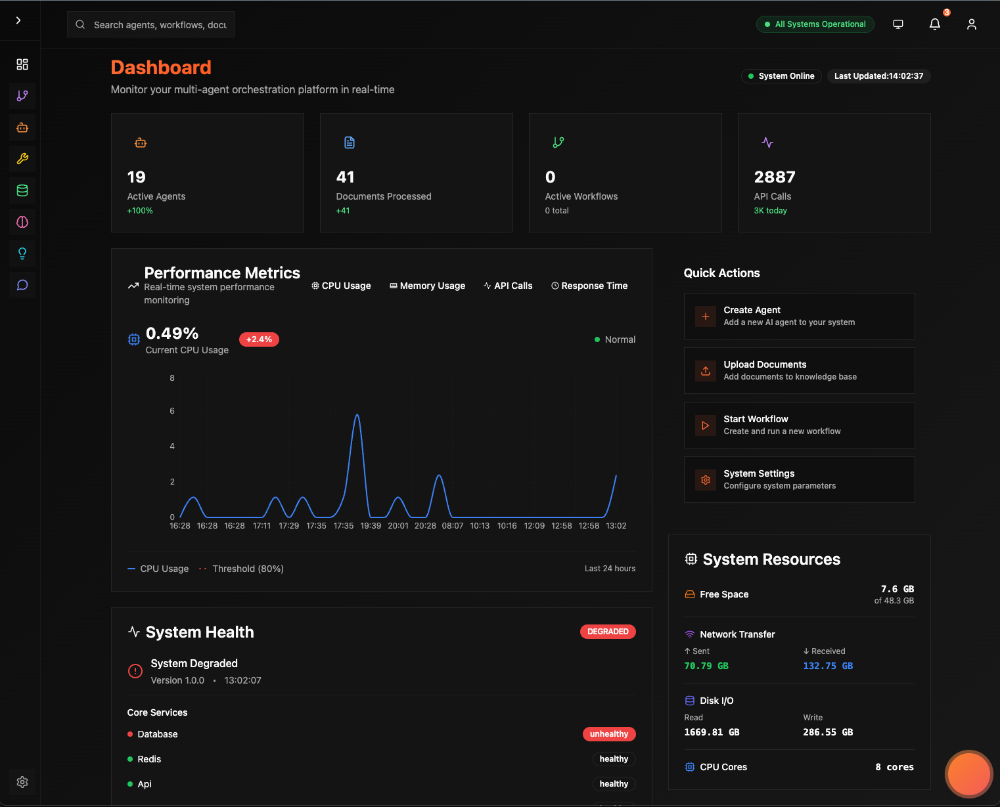
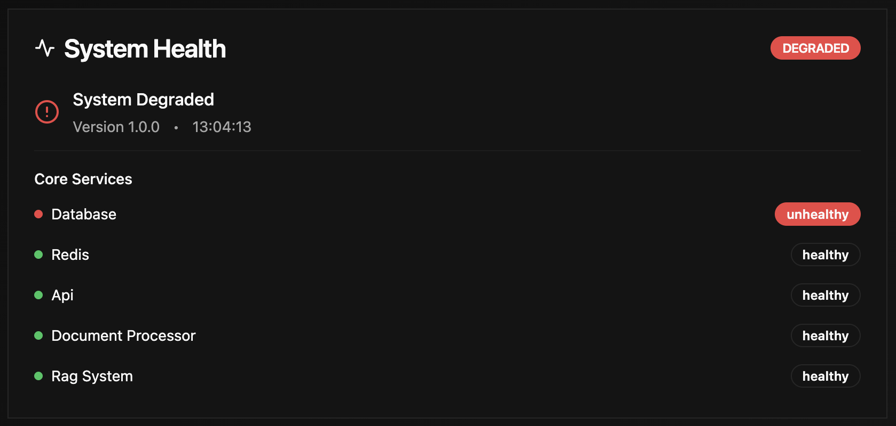
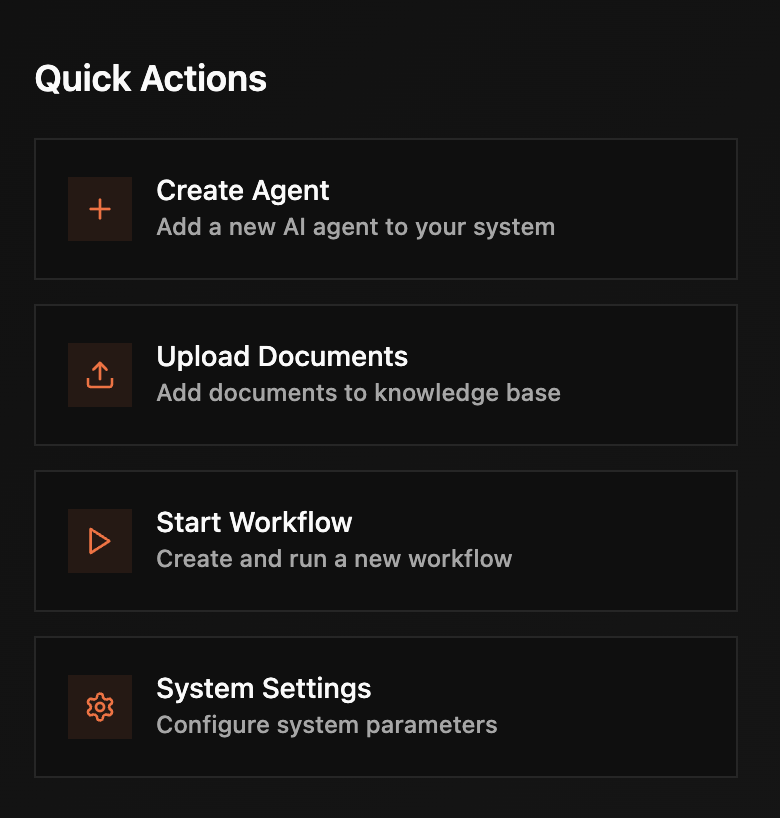

# 📊 Dashboard

*Your control room: live KPIs, runs, and system health at a glance*

---

## Overview

The **Dashboard** is your home page - a real-time overview of your entire Automatos AI system with quick access to key features.

**What You'll See**:
- ✅ System health at a glance
- ✅ Active workflows and execution status
- ✅ Agent utilization and performance
- ✅ Recent activity feed
- ✅ Quick actions for common tasks
- ✅ Key metrics and trends



---

## System Health Cards

Four key metric cards at the top show system status:

### Active Workflows

💡 *Workflows currently executing or queued. High number indicates busy system.*

- Count of active + queued workflows
- Trend indicator
- Status: 🟢 Normal (<10) | 🟡 Busy (10-20) | 🔴 Overloaded (>20)

### Total Agents

💡 *All agents created in your system. Active agents can execute tasks.*

- Total agent count
- Active agents count
- Utilization percentage
- Example: "12 agents (8 active, 67%)"

### Documents Indexed

💡 *Documents in knowledge base, searchable by all agents via RAG.*

- Total processed documents
- Currently processing
- Failed processing
- Example: "47 documents"

### System Status

💡 *Overall platform health. Green = all systems operational.*

- Status: Operational / Degraded / Down
- Component health (API, Database, Redis, Vector Search, LLM Providers)
- Uptime percentage



---

## KPIs

Key performance indicators updated in real-time:

- **Success rate** — fraction of successful runs  
- **Latency (p50/p95)** — median & tail response times  
- **Retrieval hit‑rate** — how often retrieved context was used  
- **Cost (24h)** — 24-hour spend estimate

**API**  
> **Authentication**  
> All API calls require headers:  
> ```http
> X-API-Key: <your_key>
> Authorization: Bearer <your_token>
> ```

`GET /api/system/metrics`  
```json
{ 
  "quality": {"success_rate": 0.92}, 
  "latency": {"p50": 850, "p95": 2400}, 
  "cost": {"usd_24h": 7.43}, 
  "retrieval": {"hit_rate": 0.64} 
}
```

---

## Activity Feed

Real-time stream of system events:

**Event Types**:
- 🤖 **Agent Events**: Created, started task, completed, failed
- 🔄 **Workflow Events**: Created, started, completed, failed, paused
- 📁 **Document Events**: Uploaded, processed, failed
- ⚙️ **System Events**: Settings changed, errors, warnings

💡 *Live feed of what's happening. Most recent events first.*


**Example Events**:
```
🤖 Agent "CodeReviewer Pro" completed task
   Quality: 0.94 | Duration: 4.3s | Cost: $0.05
   2 minutes ago

🔄 Workflow "Security Audit" started
   3 agents assigned | Est. 8 minutes
   5 minutes ago
```

---

## Live Runs

A rolling feed of recent executions with quick drill‑in.

**API (recommended shim)**  
`GET /api/runs/summary?limit=50`  
```json
{ 
  "runs": [{
    "id": "run_1",
    "agent_id": "agent_1",
    "status": "SUCCESS",
    "latency_ms": 920,
    "cost_usd": 0.02,
    "started_at": "2025-08-10T12:00:00Z"
  }], 
  "total": 1 
}
```

---

## Quick Actions

One-click shortcuts for common tasks:

- **➕ Create Agent**: Open agent creation wizard
- **➕ Create Workflow**: Start new workflow  
- **📤 Upload Document**: Add to knowledge base
- **🔍 Search Knowledge**: Quick semantic search
- **⚙️ Quick Settings**: Access frequently used settings
- **📊 View Analytics**: Jump to analytics dashboard



---

## Recent Workflows

Shows last 5 workflow executions with status:

Each workflow shows:
- Workflow name
- Status badge (🟢 Completed, 🔵 Running, 🟡 Queued, 🔴 Failed)
- Duration
- Agents involved
- Quality score
- Cost

**Actions**: View details, Re-run, Pause


---

## Agent Overview

Summary of agent status and utilization:

**Status Distribution**:
- 🟢 Active: Ready for tasks
- 🟡 Busy: Currently executing
- 🟠 Idle: Available but inactive
- 🔴 Error: Needs attention

**Top Performing Agents** (top 3 by success rate)

**Utilization Chart**: 60-80% is optimal


---

## A/B Testing

Toggle which **policy variant** is active.

**API**  
`GET /api/policy/abtest/get?policy_a=code_assistant_A&policy_b=code_assistant_B`  
`POST /api/policy/abtest/set`  
```json
{ 
  "policy_a": "code_assistant_A",
  "policy_b": "code_assistant_B",
  "active": "A"
}
```

---

## Navigation

**Sidebar Menu**:
- 📊 Dashboard (home)
- 🤖 Agents
- 🔄 Workflows
- 📚 Knowledge
- 🧠 Context Engineering
- 💬 AI Assistant
- 🔧 Tools
- 📖 Playbooks
- ⚙️ Settings
- 📈 Analytics

**Collapsible**: Click hamburger to show icons only


---

## Daily Checklist

💡 **Morning routine** (2-3 minutes):

1. ✅ Check system status (all green?)
2. ✅ Review overnight workflows
3. ✅ Check agent health
4. ✅ Scan activity feed for errors
5. ✅ Plan today's work

---

## Troubleshooting

### Dashboard Not Loading
1. Check internet connection
2. Clear browser cache
3. Try incognito mode
4. Check browser console for errors

### KPIs Empty
- Ensure `/api/system/metrics` returns JSON
- 401s? Add CORS + ensure headers are forwarded

### Metrics Not Updating
1. Check auto-refresh enabled
2. Click manual refresh button
3. Verify WebSocket connection
4. Reload page

---

**Next**: [Agents →](agents.md) | [Workflows →](workflows.md) | [Analytics →](analytics.md)
