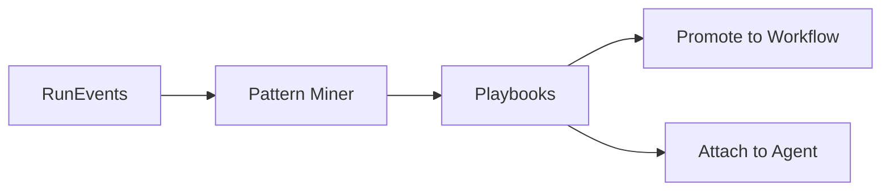

# 📖 Playbooks Guide

*Learn from success - discover and reuse proven workflow patterns*

---

## 📖 Table of Contents

1. [Overview](#overview)
2. [Quick Start](#quick-start)
3. [Pattern Discovery](#pattern-discovery)
4. [Discovered Playbooks](#discovered-playbooks)
5. [Creating Workflows from Playbooks](#creating-workflows-from-playbooks)
6. [Common Tasks](#common-tasks)
7. [Tips & Best Practices](#tips--best-practices)

---

## Overview

### What are Playbooks?

Playbooks are automatically discovered patterns from your successful workflow executions. The system uses machine learning (FP-Growth algorithm) to identify what works and package it for reuse.

**Access**: Navigate to **Playbooks** from the sidebar


### What Can You Do Here?

- ✅ **View discovered patterns** from past workflows
- ✅ **Create workflows** from playbooks (1-click)
- ✅ **Browse by category** (security, development, data, etc.)
- ✅ **See success rates** and performance metrics
- ✅ **Mine new patterns** manually
- ✅ **Share playbooks** with team

### How Pattern Discovery Works

```
Your Workflows Execute
        ↓
Successful Outcomes Logged
        ↓
FP-Growth Algorithm Analyzes Patterns
        ↓
Common Successful Patterns Identified
        ↓
Playbooks Created Automatically
        ↓
Reuse with 1-Click Workflow Creation
```

💡 *Tooltip: "Pattern mining runs nightly. Requires minimum 5 similar successful workflows."*

---

## Quick Start

### Use Your First Playbook (2 Minutes)

**Goal**: Create workflow from discovered pattern

**Steps**:

1. Go to Playbooks page
2. Browse available playbooks
3. Find "Code Security Review" playbook
4. Click **"Create Workflow"**
5. Enter your specifics (repository, etc.)
6. Click **"Create & Execute"**

⏱️ **Time**: 2 minutes  
🎯 **Result**: Workflow running using proven pattern

---

## Pattern Discovery

### Discovery Statistics

**📊 Discovered Patterns**  
💡 *Tooltip: "Total playbooks automatically discovered from your workflow history"*

- Count of playbooks
- New this week
- Example: "12 playbooks"

**✅ Success Rate**  
💡 *Tooltip: "Average success rate of workflows using playbooks vs ad-hoc workflows"*

- Playbook workflows: 96%
- Non-playbook workflows: 87%
- Improvement: +9%

**⏱️ Time Saved**  
💡 *Tooltip: "Estimated time saved using playbooks vs creating workflows from scratch"*

- Hours saved this month
- Example: "~8 hours"

**🎯 Pattern Confidence**  
💡 *Tooltip: "Statistical confidence in discovered patterns. Higher = more reliable."*

- Average confidence
- Example: "92%"


### Mining New Patterns

**Manual Pattern Mining**:

Click **"Mine Patterns"** to analyze workflows:

**Mining Configuration**:

**Time Range**  
💡 *Tooltip: "Analyze workflows from this period"*

- Last 7 days
- Last 30 days
- Last 90 days
- Custom range

**Minimum Support**  
💡 *Tooltip: "Minimum times a pattern must occur to be considered. Higher = more common patterns only."*

- Range: 3-20 occurrences
- Recommended: 5 occurrences

**Minimum Confidence**  
💡 *Tooltip: "Statistical confidence threshold. Higher = only very reliable patterns."*

- Range: 0.5-1.0
- Recommended: 0.8 (80%)

**Filter by Category**:
- All categories
- Security only
- Development only
- etc.


**Click "Mine Patterns"**:
- Analysis runs (10-30 seconds)
- New playbooks discovered
- Added to playbooks list
- Notification shown

---

## Discovered Playbooks

### Playbook List

**Playbook Cards** show:

**Playbook Information**:
- **Name**: Auto-generated or custom
- **Category Badge**: Color-coded category
- **Description**: What this pattern does
- **Confidence**: Statistical confidence (0-100%)
- **Support**: How many workflows match this pattern

**Pattern Details**:

💡 *Tooltip: "The sequence of agents, tools, and settings that define this pattern"*

**Agent Pattern**:
```
CodeArchitect → SecurityExpert → DocumentGenerator
```

**Tool Pattern**:
- GitHub (read, write)
- CodeGraph (read)
- Slack (notifications)

**Context Pattern**:
- Typical context fields
- Required inputs
- Common configurations


**Performance Metrics**:
- **Success Rate**: 96.7%
- **Avg Duration**: 4m 23s
- **Avg Cost**: $0.18
- **Usage Count**: 23 times used
- **Quality Score**: 0.91

**Actions**:
- **Create Workflow**: Use this playbook
- **View Details**: See full pattern
- **Edit**: Customize playbook (save as new)
- **Share**: Share with team
- **Archive**: Hide if not useful

### Filtering Playbooks

**Category Filter**  
💡 *Tooltip: "Filter by playbook category"*

- All Categories
- Security & Compliance
- Code Review & Quality
- Data Analysis
- Infrastructure & DevOps
- Documentation
- Testing & QA

**Confidence Filter**:
- All confidence levels
- High confidence (>90%)
- Medium confidence (70-90%)
- Low confidence (<70%)

**Sort Options**:
- Most used
- Highest success rate
- Highest confidence
- Newest first


---

## Creating Workflows from Playbooks

### Playbook to Workflow

**Click "Create Workflow" on playbook**:

**Create Workflow from Playbook Modal**:

💡 *Tooltip: "Pre-configured workflow from proven pattern. Customize as needed."*


**Pre-Filled Fields**:

**Workflow Name**  
- Auto-suggested based on playbook
- Example: "Code Security Review - Oct 2024"
- Customizable

**Description**  
- Pre-filled from playbook
- Edit to specify this instance

**Goal**  
- Template goal from playbook
- Fill in specifics:
  - Template: "Review {{repository}} for security issues"
  - Your goal: "Review github.com/myorg/myapp for security issues"

**Agents** (pre-selected from pattern)  
💡 *Tooltip: "Agents pre-selected based on successful pattern. Can modify."*

- CodeArchitect-001 ✅
- SecurityExpert-003 ✅
- (Add more agents if needed)

**Tools** (pre-configured)  
- GitHub ✅
- CodeGraph ✅
- Slack ✅

**Execution Policy** (from pattern):
- Execution mode: Sequential (proven to work)
- Error handling: Continue on error
- Timeout: 15 minutes

**Context** (template provided):

```json
{
  "repository": "{{your-repo-here}}",
  "branch": "main",
  "focus_areas": ["security", "authentication"]
}
```

Fill in your values.

**Success Prediction**  
💡 *Tooltip: "Estimated success probability based on pattern history"*

- Based on: 23 similar workflows
- Success rate: 96.7%
- Confidence: 92%

**Create Options**:
- **Create Only**: Save workflow (don't execute)
- **Create & Execute**: Run immediately
- **Save as Template**: Save for repeated use

---

## Common Tasks

### Task 1: Using a Playbook

**Scenario**: Need to review code for security

**Steps**:

1. Playbooks page
2. Filter category: "Security"
3. Find "Code Security Review" playbook
4. Click "Create Workflow"
5. Fill in your repository URL
6. Click "Create & Execute"
7. Monitor in Workflows → Live tab

⏱️ **Time**: 2 minutes  
🎯 **Result**: Security review running

### Task 2: Discovering New Patterns

**Scenario**: You've run many workflows, want to find patterns

**Steps**:

1. Click **"Mine Patterns"** button
2. **Time Range**: Last 30 days
3. **Minimum Support**: 5
4. **Minimum Confidence**: 0.8
5. Click "Mine"
6. Wait 10-30 seconds
7. Review newly discovered patterns
8. Save useful ones as playbooks

⏱️ **Time**: 2 minutes  
🎯 **Result**: New playbooks discovered

### Task 3: Customizing a Playbook

**Scenario**: Playbook is close but need modifications

**Steps**:

1. Find playbook
2. Click "View Details"
3. Click "Edit" or "Customize"
4. Modify:
   - Agent selection
   - Tool assignments
   - Execution policy
5. Save as new playbook: "My Custom Security Review"
6. Use your customized version

⏱️ **Time**: 5 minutes  
🎯 **Result**: Personalized playbook

---

## Tips & Best Practices

### Maximizing Pattern Discovery

💡 **Tips**:

1. **Run workflows consistently**: Patterns need repetition
2. **Use similar structures**: Same agent types, similar goals
3. **Tag workflows**: Helps categorization
4. **Mark successes**: Ensure successful workflows logged correctly
5. **Review regularly**: Mine patterns monthly

### Playbook Maintenance

**Keep playbooks relevant**:
1. Archive outdated playbooks
2. Update playbooks when processes change
3. Track playbook performance
4. Merge similar playbooks
5. Delete low-performing patterns

### When to Use Playbooks

**Use playbooks for**:
- ✅ Recurring workflows
- ✅ Proven processes
- ✅ Team consistency
- ✅ Quick execution

**Create custom workflows for**:
- ❌ One-off tasks
- ❌ Experimental processes
- ❌ Highly variable tasks

---

## FAQ

### How are patterns discovered?

**FP-Growth Algorithm**:
1. Analyzes successful workflow history
2. Identifies frequent patterns
3. Calculates confidence scores
4. Creates playbooks from patterns

Runs automatically nightly, or manually on-demand.

### Can I create playbooks manually?

**Not directly**, but you can:
1. Create workflow with desired pattern
2. Execute successfully multiple times (5+)
3. System discovers pattern
4. Save as playbook

Or:
1. Use "Save as Template" on successful workflow
2. Appears in Templates (similar to playbooks)

### What's the difference between playbooks and templates?

**Playbooks**:
- Automatically discovered from history
- Based on actual successful executions
- Statistical confidence scores
- Machine learning powered

**Templates**:
- Manually created by users
- Pre-configured starting points
- No statistical validation
- User-defined

Both create workflows, different origins.

### How often do patterns update?

**Automatically**: Nightly at 2 AM (configurable)

**Manually**: Click "Mine Patterns" anytime

**Updates include**:
- New patterns discovered
- Confidence scores updated
- Success rates recalculated
- Low-performing patterns archived

---

**Next**: [Settings Guide →](../SETTINGS.md)

*Configure system settings, credentials, and security*


---

## API Reference


## Mine Patterns
Scope by tenant, set **min support** and **top‑k**, then **Mine**.

**API**  
> **Authentication**  
> All API calls require headers:  
> ```http
> X-API-Key: <your_key>
> Authorization: Bearer <your_token>
> ```

`POST /api/playbooks/mine`  
```json
{ "tenant_id":"demo","min_support":4,"top_k":20,"name_prefix":"auto" }
```

## Inspect & Evaluate
For each pattern see **steps**, **support**, **success rate**, and optionally **median latency/cost**. Click to view details and example runs.

## Promote to Workflow
Turn a pattern into a workflow template.

**API (optional)**  
`POST /api/playbooks/promote`  
```json
{ "playbook_id":"pb_123","name":"Triage & Fix" }
```

## Attach to Agents
Bind a playbook as an **auto‑triggered macro** with rules.

**API (optional)**  
`POST /api/playbooks/attach`  
```json
{ "playbook_id":"pb_123","agent_id":"agent_7","triggers":{"keywords":["triage"],"intent":["bug"]} }
```

## Troubleshooting
- No patterns? Ensure telemetry (**RunTrace/RunEvent**) includes step names and outcomes.
- Too noisy? Increase **min_support** or filter by agent/workflow.

## Diagram (mining flow)

