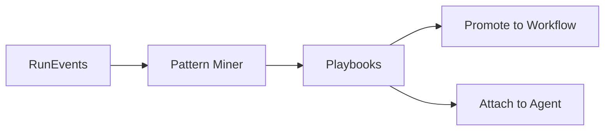

Playbooks capture **reusable patterns** discovered from **RunEvents**.

## Mine Patterns
Scope by tenant, set **min support** and **top‑k**, then **Mine**.

**API**  
> **Authentication**  
> All API calls require headers:  
> ```http
> X-API-Key: <your_key>
> Authorization: Bearer <your_token>
> ```

`POST /api/playbooks/mine`  
```json
{ "tenant_id":"demo","min_support":4,"top_k":20,"name_prefix":"auto" }
```

## Inspect & Evaluate
For each pattern see **steps**, **support**, **success rate**, and optionally **median latency/cost**. Click to view details and example runs.

## Promote to Workflow
Turn a pattern into a workflow template.

**API (optional)**  
`POST /api/playbooks/promote`  
```json
{ "playbook_id":"pb_123","name":"Triage & Fix" }
```

## Attach to Agents
Bind a playbook as an **auto‑triggered macro** with rules.

**API (optional)**  
`POST /api/playbooks/attach`  
```json
{ "playbook_id":"pb_123","agent_id":"agent_7","triggers":{"keywords":["triage"],"intent":["bug"]} }
```

## Troubleshooting
- No patterns? Ensure telemetry (**RunTrace/RunEvent**) includes step names and outcomes.
- Too noisy? Increase **min_support** or filter by agent/workflow.

## Diagram (mining flow)

