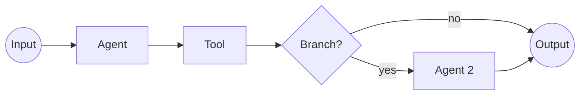

# 🔄 Workflow Management Guide

*Orchestrate complex automation with intelligent multi-agent workflows*

---

## 📖 Table of Contents

1. [Overview](#overview)
2. [Quick Start](#quick-start)
3. [Active Tab](#active-tab)
4. [Templates Tab](#templates-tab)
5. [History Tab](#history-tab)
6. [Monitoring Tab](#monitoring-tab)
7. [Live Tab (Execution Theater)](#live-tab-execution-theater)
8. [Creating Workflows](#creating-workflows)
9. [Executing Workflows](#executing-workflows)
10. [Common Tasks](#common-tasks)
11. [Advanced Features](#advanced-features)
12. [Troubleshooting](#troubleshooting)

---

## Overview

### What is Workflow Management?

Workflows are coordinated sequences of agents working together to accomplish complex tasks. Think of workflows as projects where multiple AI agents collaborate like a team.

**Access**: Navigate to **Workflows** from the main sidebar


### What Can You Do Here?

- ✅ **Create workflows** with multiple coordinated agents
- ✅ **Monitor execution** in real-time with live progress
- ✅ **Use templates** for common automation patterns
- ✅ **Track history** of all workflow executions
- ✅ **Optimize performance** with detailed monitoring
- ✅ **Watch live** with the Execution Theater

### Page Layout

The Workflows page has **5 main tabs**:

1. **▶️ Active** - Currently running workflows
2. **📋 Templates** - Reusable workflow patterns
3. **🕐 History** - Past workflow executions
4. **📊 Monitoring** - Real-time performance metrics
5. **🎬 Live** - Execution Theater (immersive view)

---

## Quick Start

### Running Your First Workflow (5 Minutes)

**Goal**: Execute a pre-built workflow template

**Steps**:

1. Go to **Templates** tab
2. Find "Code Review Workflow" template
3. Click **"Use Template"**
4. Enter workflow details:
   - Name: "Review PR #123"
   - Context: Add your repository info
5. Click **"Create & Execute"**
6. Switch to **Live** tab to watch execution

⏱️ **Time**: 5 minutes  
🎯 **Result**: Workflow completes with results

**[See detailed walkthrough →](#executing-workflows)**

---

## Active Tab

### Overview

Shows all currently running or pending workflows.

💡 *Tooltip: "Monitor active workflows with real-time progress updates"*


### Statistics Cards

**🔄 Active Workflows**  
💡 *Tooltip: "Workflows currently executing. Includes running and queued workflows."*

- Count of active + queued workflows
- Changes from previous period
- Example: "3 workflows"

**✅ Completed Today**  
💡 *Tooltip: "Successfully completed workflows in the last 24 hours"*

- Today's completion count
- Success rate percentage
- Example: "12 completed"

**⏱️ Avg Duration**  
💡 *Tooltip: "Average time from start to completion. Helps estimate new workflows."*

- Average execution time
- Trend indicator
- Example: "5m 23s"

**🤖 Agent Utilization**  
💡 *Tooltip: "Percentage of agents currently working on workflows. Higher = busier system."*

- Active agents / Total agents
- Utilization percentage
- Example: "67%"


### Workflow Cards

Each active workflow shows:

**Header**:
- **Workflow Name**
- **Status Badge**: 
  - 🔵 Running (blue)
  - 🟡 Queued (yellow)
  - 🟢 Completing (green)
  - 🔴 Error (red)
- **Elapsed Time**: Time since start

**Progress Indicator**:

💡 *Tooltip: "Visual progress through workflow stages. Each segment represents a task or agent."*

- Progress bar with percentage
- Current stage highlighted
- Estimated time remaining

**Agents Involved**:
- Icons/avatars of participating agents
- Agent status indicators
- Current agent highlighted


**Live Metrics**:
- **Subtasks**: Completed / Total
- **Quality**: Current quality score
- **Tokens**: Tokens used so far
- **Cost**: Estimated cost

**Action Buttons**:
- **👁️ Watch**: Open in Execution Theater
- **⏸️ Pause**: Temporarily halt execution
- **⏹️ Stop**: Cancel workflow
- **📄 View Details**: Open detailed modal

### Quick Actions

**Create Workflow**: Opens [Create Workflow Modal](#create-workflow-modal)

**Refresh**: Reload active workflows (auto-refreshes every 5s)

**Filter**: Filter by status, agent, or tags

---

## Templates Tab

### Overview

Browse and use pre-built workflow templates for common automation patterns.

💡 *Tooltip: "Templates are proven workflow patterns. One-click creation with your custom settings."*


### Template Categories

**🔒 Security & Compliance**:
- Security Audit Workflow
- Compliance Check Workflow
- Vulnerability Scan Workflow

**💻 Development**:
- Code Review Workflow
- PR Analysis Workflow
- Documentation Generation Workflow

**📊 Data & Analytics**:
- Data Analysis Workflow
- Report Generation Workflow
- Insight Discovery Workflow

**🚀 DevOps**:
- Deployment Workflow
- Infrastructure Audit Workflow
- Performance Testing Workflow


### Template Cards

Each template shows:

**Template Information**:
- **Name**: Template identifier
- **Category Badge**: Color-coded category
- **Description**: What the workflow does
- **Usage Count**: How many times used
- **Success Rate**: Historical success %
- **Avg Duration**: Typical execution time
- **Avg Cost**: Typical cost


**Agent Pattern**:

Shows the sequence of agents:
```
CodeArchitect → SecurityExpert → DocumentGenerator
```

💡 *Tooltip: "Agent execution order. Arrows indicate sequential execution, parallel shown side-by-side."*

**Performance Stats**:
- ⏱️ **4m 5s avg** execution time
- 💰 **$0.12 avg** cost
- 🎯 **23 uses** historical
- ⭐ **95.7%** success rate

**Actions**:
- **Use Template**: Create workflow from this template
- **Preview**: View template details
- **Customize**: Modify before creation

### Using a Template

**Steps**:

1. Click **"Use Template"** on desired template
2. **Workflow Name**: Enter custom name
3. **Description** (optional): Describe this instance
4. **Context**: Provide task-specific information
   ```json
   {
     "repository": "github.com/myorg/myapp",
     "branch": "main",
     "pr_number": 123
   }
   ```
5. **Customize Agents** (optional):
   - Add extra agents
   - Remove agents
   - Change agent order
6. Click **"Create Workflow"**

⏱️ **Time**: 2 minutes  
🎯 **Result**: Workflow created and ready to execute

---

## History Tab

### Overview

View all past workflow executions with detailed results.

💡 *Tooltip: "Complete execution history. Review past workflows, analyze patterns, learn from failures."*


### History Filters

**Time Range**  
💡 *Tooltip: "Filter by execution date. Narrow down to find specific workflows."*

- Last 24 hours
- Last 7 days
- Last 30 days
- Last 90 days
- Custom range

**Status Filter**  
💡 *Tooltip: "Filter by execution outcome"*

- All: Show everything
- ✅ Completed: Successful executions
- ❌ Failed: Failed executions
- ⏸️ Paused: Manually paused
- ⏹️ Cancelled: Manually stopped

**Agent Filter**  
💡 *Tooltip: "Show only workflows that used specific agents"*

- Select agent from dropdown
- Shows all workflows involving that agent

**Search**:
- Search by workflow name
- Search by description
- Search by tags


### Execution Records

Each history entry shows:

**Execution Summary Card**:

- **Workflow Name**: Original workflow name
- **Status Badge**: Final status with color
- **Execution ID**: Unique identifier
- **Started**: Start timestamp
- **Duration**: Total execution time
- **Quality Score**: Overall quality (0.0-1.0)
- **Cost**: Total cost for execution


**Agents Involved**:
- Icons of all participating agents
- Agent status during execution
- Time each agent was active

**Results Summary**:
- Subtasks completed
- Success rate
- Issues encountered
- Output artifacts

**Actions**:
- **📄 View Results**: See detailed execution results
- **🔄 Re-run**: Execute same workflow again
- **📊 Compare**: Compare with other executions
- **💾 Export**: Download execution data

### Execution Details

Click on any execution to see full details:

**Detailed Results Modal**:

💡 *Tooltip: "Complete breakdown of workflow execution with all agent outputs"*

Shows:
1. **Timeline**: Visual timeline of execution
2. **Agent Outputs**: Results from each agent
3. **Quality Scores**: Breakdown by subtask
4. **Resource Usage**: Tokens and costs
5. **Logs**: Complete execution logs
6. **Artifacts**: Generated files/outputs


---

## Monitoring Tab

### Overview

Real-time monitoring of workflow internals - memory, RAG, tools.

💡 *Tooltip: "Advanced monitoring of workflow execution internals. See how context engineering and tools are being used."*


### Sub-Tabs

The Monitoring tab has **3 sub-tabs**:

#### 1. Memory

**What it shows**:
- Memory items created during execution
- Working memory state
- Memory consolidation events
- Cross-agent memory sharing

**Memory Activity Feed**  
💡 *Tooltip: "Real-time stream of memory operations during workflow execution"*

Each entry shows:
- **Timestamp**: When memory was stored/retrieved
- **Agent**: Which agent accessed memory
- **Operation**: Store, Retrieve, Update, Delete
- **Memory Type**: Experience, Knowledge, Skill, Tool Usage
- **Content Preview**: First 100 characters
- **Importance**: Score 0.0-1.0


**Memory Statistics**:
- Total items stored
- Memory by tier (working/short-term/long-term)
- Memory by agent
- Consolidation events

#### 2. RAG (Retrieval-Augmented Generation)

**What it shows**:
- Document retrievals during execution
- RAG query performance
- Context chunks used
- Retrieval quality scores

**RAG Activity Feed**  
💡 *Tooltip: "Track when agents search knowledge base for context"*

Each RAG query shows:
- **Agent**: Who made the query
- **Query**: Search text
- **Results**: Number of chunks retrieved
- **Latency**: Time taken
- **Relevance**: Average similarity score
- **Tokens**: Token count of retrieved context


**RAG Performance**:
- Total queries made
- Average latency
- Cache hit rate
- Token efficiency

**Retrieved Chunks Preview**:
- Source documents used
- Chunk text previews
- Similarity scores
- How chunks were used

#### 3. Tools

**What it shows**:
- External tools called during execution
- Tool call success/failure
- Tool response times
- Integration errors

**Tool Activity Feed**  
💡 *Tooltip: "Monitor external tool usage. Identify slow tools or failing integrations."*

Each tool call shows:
- **Agent**: Who called the tool
- **Tool Name**: Which integration
- **Method**: What action (e.g., "createPullRequest")
- **Status**: ✅ Success, ❌ Failed, ⏳ Pending
- **Duration**: Time taken
- **Result Preview**: Output summary


**Tool Statistics**:
- Total tool calls
- Success rate by tool
- Average latency by tool
- Failed tool calls (with errors)

**Tool Performance Alerts**:
- 🔴 Slow tools (>5s response)
- 🔴 Failing tools (>10% failure rate)
- 🟡 Rate-limited tools
- 🟢 Healthy tools

---

## Live Tab (Execution Theater)

### Overview

The Execution Theater is an immersive, real-time view of workflow execution.

💡 *Tooltip: "Watch workflows execute in real-time with cinematic visualization. Perfect for demos and debugging."*


### Theater Features

**Full-Screen Mode**:
- Click full-screen icon (top right)
- Immersive execution view
- Press Esc to exit

**Agent Visualization**:

Shows each agent as a card/avatar with:
- Agent name and icon
- Current status (idle/thinking/executing/complete)
- Progress indicator
- Current task description
- Thinking animation while processing


**Execution Flow**:

Visual representation of workflow stages:
1. **Task Decomposition**: LLM breaks down the goal
2. **Agent Selection**: System chooses optimal agents
3. **Context Engineering**: Building optimal prompts
4. **Execution**: Agents performing tasks
5. **Aggregation**: Combining results
6. **Learning**: Storing patterns

Each stage animates as it completes.

**Live Logs Panel**:

💡 *Tooltip: "Real-time log stream. See exactly what each agent is doing."*

- Scrolling log feed
- Color-coded by agent
- Filterable by log level
- Copy/export logs


**Performance Metrics** (bottom bar):
- ⏱️ Elapsed time
- 🎯 Subtasks completed
- 🪙 Tokens used
- 💰 Estimated cost
- 📊 Quality score (updates as tasks complete)

### Sub-Tabs in Theater

**Overview** (default):
- Full execution visualization
- All agents visible
- Combined progress

**Memory**:
- Memory operations in real-time
- Memory graph visualization
- Inter-agent memory sharing

**Communication**:
- Agent-to-agent messages
- Communication flow diagram
- Message history

**Learning**:
- Patterns being learned
- Knowledge being stored
- Performance improvements


---

## Creating Workflows

### Create Workflow Modal

Click **"Create Workflow"** button to open 2-step wizard.


### Step 1: Details

**Workflow Name** (required)  
💡 *Tooltip: "Descriptive name for this workflow. Include the goal or project identifier."*

- Clear, specific names
- Include version if iterating
- Example: "Security Audit - Q4 2024"

**Description** (optional)  
💡 *Tooltip: "Explain what this workflow does and when to use it"*

- What problem does it solve?
- What are the inputs/outputs?
- Any special notes

**Goal** (required)  
💡 *Tooltip: "The high-level objective. The orchestrator uses this to decompose tasks."*

- Clear, specific goal statement
- **Good**: "Perform comprehensive security audit of authentication system checking for SQL injection, XSS, and authentication bypass vulnerabilities"
- **Bad**: "Review code"


**Tags** (optional)  
💡 *Tooltip: "Organize workflows with tags. Helps filtering and searching."*

- Add relevant tags
- Examples: "security", "production", "weekly"
- Suggestions based on goal

**Category** (optional):
- Security
- Development
- Data Analysis
- Infrastructure
- Custom

### Step 2: Configuration & Policy

**Agent Selection**:

💡 *Tooltip: "Choose which agents participate. Leave empty for automatic selection based on task requirements."*

**Manual Selection**:
- Select specific agents from dropdown
- Define execution order
- Set agent roles (lead, support)

**Automatic Selection** (recommended):  
💡 *Tooltip: "Let the orchestrator choose optimal agents based on skills and availability"*

- ✅ Enable "Auto-Select Agents"
- System analyzes goal
- Picks best agents automatically
- Uses LLM reasoning for selection


**Execution Policy**:

💡 *Tooltip: "Rules governing workflow execution behavior"*

**Execution Mode**:
- **Parallel**: Run independent tasks simultaneously (faster)
- **Sequential**: One task at a time (safer)
- **Optimized**: Mix of parallel/sequential (recommended)

**Error Handling**:
- **Stop on Error**: Halt if any task fails
- **Continue**: Skip failed tasks, continue with rest
- **Retry**: Auto-retry failed tasks (1-5 attempts)

**Timeout**:
- **Per Task**: Max time for individual tasks (default: 5 min)
- **Whole Workflow**: Max total time (default: 30 min)

**Resource Limits**:
- **Token Budget**: Max tokens for entire workflow
- **Cost Budget**: Max cost in USD
- **Agent Limit**: Max agents to use

**Context Configuration**:

💡 *Tooltip: "Add context that all agents can access during execution"*

```json
{
  "repository": "https://github.com/myorg/myapp",
  "codegraph_project": "myapp",
  "compliance_standards": ["SOC2", "GDPR"],
  "custom_data": {...}
}
```

### Review & Create

**Final Review**:
- Workflow name and goal
- Selected/auto-selected agents
- Execution policy summary
- Estimated duration
- Estimated cost

**Buttons**:
- **← Back**: Modify settings
- **Create**: Create workflow (don't execute)
- **Create & Execute**: Create and run immediately

---

## Executing Workflows

### Manual Execution

**From History or Templates**:

1. Find the workflow
2. Click **"Run"** or **"Re-run"** button
3. **Confirm execution** (optional input data)
4. Click **"Execute Workflow"**


### Execution Process

**Phase 1: Initialization** (2-5 seconds)

💡 *Tooltip: "Setting up execution environment and loading agents"*

- Load workflow definition
- Initialize agents
- Prepare execution context
- Queue workflow

**Phase 2: Task Decomposition** (5-15 seconds)

💡 *Tooltip: "LLM analyzes the goal and breaks it into subtasks"*

- Goal analyzed by orchestrator
- Subtasks identified
- Dependencies mapped
- Priorities assigned

**Phase 3: Agent Selection** (3-10 seconds)

💡 *Tooltip: "Optimal agents chosen using 4D matching (skills, availability, history, tools)"*

- Agent capabilities evaluated
- Best matches selected
- Assignments confirmed
- Agents notified

**Phase 4: Context Engineering** (5-20 seconds)

💡 *Tooltip: "Optimizing context for each agent using RAG and memory retrieval"*

- Relevant documents retrieved
- Agent memories loaded
- Context optimized for token budget
- Prompts generated

**Phase 5: Execution** (variable, 30s-10min)

💡 *Tooltip: "Agents executing their assigned tasks. Progress updates in real-time."*

- Agents work in parallel/sequential
- Tools called as needed
- Results shared between agents
- Progress updates sent

**Phase 6: Aggregation** (5-10 seconds)

💡 *Tooltip: "Combining agent results into coherent final output"*

- Results collected
- Quality scores calculated
- Conflicts resolved
- Final output generated

**Phase 7: Learning** (2-5 seconds)

💡 *Tooltip: "Storing patterns and updating agent knowledge"*

- Patterns extracted
- Successful strategies saved
- Agent memories updated
- Performance metrics recorded


### Monitoring Execution

**Real-time Updates**:

Switch to **Active tab** to see:
- Current progress percentage
- Current executing agent
- Completed subtasks
- Estimated time remaining

Switch to **Live tab** for immersive view:
- Full visualization
- Live logs
- Agent animations
- Real-time metrics

**WebSocket Connection**:

💡 *Tooltip: "Live connection for real-time updates. Green = connected, Red = disconnected"*

- Shows connection status icon
- Auto-reconnects if dropped
- Updates every 1-2 seconds

---

## Common Tasks

### Task 1: Create Simple Security Review Workflow

**Goal**: Review code for security issues

**Steps**:

1. Click **"Create Workflow"**
2. **Name**: "Security Review - Main Branch"
3. **Goal**: "Review authentication module for SQL injection, XSS, and authentication bypass vulnerabilities"
4. **Context**:
   ```json
   {
     "codegraph_project": "myapp",
     "file_path": "auth/middleware.py"
   }
   ```
5. **Auto-select agents**: ✅ Enabled
6. Click **"Create & Execute"**

⏱️ **Time**: 3 minutes setup + 2-4 minutes execution  
🎯 **Result**: Security audit report

### Task 2: Using a Template for PR Review

**Goal**: Automatically review pull request

**Steps**:

1. Go to **Templates** tab
2. Find "PR Review Workflow"
3. Click **"Use Template"**
4. **Name**: "PR #456 Review"
5. **Context**:
   ```json
   {
     "repository": "https://github.com/myorg/myapp",
     "pr_number": 456,
     "branch": "feature/new-auth"
   }
   ```
6. Click **"Create & Execute"**
7. Go to **Live** tab to watch

⏱️ **Time**: 2 minutes setup + 3-6 minutes execution  
🎯 **Result**: PR review with suggestions

### Task 3: Monitoring a Running Workflow

**Goal**: Watch workflow progress and intervene if needed

**Steps**:

1. Go to **Active** tab
2. Find your running workflow
3. Note current stage and progress
4. Click **"Watch"** to open Execution Theater
5. Monitor:
   - Which agent is active
   - What task they're executing
   - Live logs for details
6. **If Issues**:
   - Pause workflow (⏸️ button)
   - Review logs
   - Stop if necessary (⏹️ button)

⏱️ **Time**: Continuous monitoring  
🎯 **Result**: Awareness of execution state

### Task 4: Analyzing Workflow Performance

**Goal**: Understand why a workflow succeeded or failed

**Steps**:

1. Go to **History** tab
2. Find the workflow execution
3. Click to open details
4. Review:
   - **Timeline**: Which stage took longest?
   - **Agent Performance**: Did any agent struggle?
   - **Quality Scores**: Which subtasks scored low?
   - **Logs**: Any errors or warnings?
5. Identify improvements:
   - Better agent selection?
   - More context needed?
   - Different execution policy?

⏱️ **Time**: 5-10 minutes  
🎯 **Result**: Actionable optimization insights

### Task 5: Pausing and Resuming a Workflow

**Goal**: Temporarily halt execution and resume later

**Steps to Pause**:

1. Go to **Active** tab
2. Find running workflow
3. Click **⏸️ Pause** button
4. Confirm pause action
5. Workflow stops after current subtask completes

**Steps to Resume**:

1. Paused workflow shows "Paused" badge
2. Click **▶️ Resume** button
3. Workflow continues from where it stopped
4. All context preserved

⏱️ **Time**: Instant pause, resume within seconds  
🎯 **Use case**: Need to update context, wait for approvals, etc.

---

## Advanced Features

### Custom Workflow Templates

🔧 **Advanced**

Create reusable templates from your successful workflows.

**How to Create Template**:

1. Go to History tab
2. Find successful execution
3. Click "⋮" menu → "Save as Template"
4. **Template Name**: "My Custom Review"
5. **Make Public**: Share with team (optional)
6. Click "Save Template"

**Template appears in Templates tab** for reuse.

### Workflow Orchestration Policies

🔧 **Advanced**

Fine-tune how the orchestrator manages execution.

**Agent Selection Policy**:

💡 *Tooltip: "Algorithm for choosing agents. Default uses LLM reasoning."*

- **LLM-Driven**: Orchestrator reasons through selection (recommended)
- **Algorithmic**: Fixed algorithm (fast, less flexible)
- **Manual**: You specify all agents
- **Hybrid**: Mix of manual + automatic

**Task Decomposition Strategy**:

💡 *Tooltip: "How complex goals are broken into subtasks"*

- **Hierarchical**: Nested subtasks with dependencies
- **Flat**: All subtasks at same level
- **Adaptive**: Adjusts based on complexity

**Result Aggregation Method**:

💡 *Tooltip: "How multiple agent outputs are combined"*

- **LLM Synthesis**: LLM combines results (highest quality)
- **Concatenation**: Simple joining (fastest)
- **Voting**: Consensus-based (for decisions)
- **Weighted**: Based on agent confidence scores

### Workflow Variables and Context

🔧 **Advanced**

Pass dynamic data to workflows:

**Context Variables**:

```json
{
  "repository": "{{repository_url}}",
  "branch": "{{branch_name}}",
  "pr_number": "{{pr_id}}",
  "reviewer": "{{github_username}}"
}
```

**Variable Substitution**:
- Use {{variable_name}} syntax
- Replaced at execution time
- Can reference environment variables
- Useful for templatized workflows

**Conditional Execution**:

```json
{
  "condition": "{{quality_score}} < 0.7",
  "then": "run_additional_review",
  "else": "mark_approved"
}
```

---

## Tips & Best Practices

### Workflow Design

💡 **Best Practices**:

1. **Start simple**: Single agent workflows first
2. **Clear goals**: Specific, measurable objectives
3. **Good context**: Provide relevant information
4. **Test incrementally**: Don't create huge workflows initially
5. **Use templates**: Leverage proven patterns

### Naming Conventions

**Good workflow names**:
- ✅ "Security Audit - Authentication Module - Q4"
- ✅ "PR Review - Feature/NewAuth - #456"
- ✅ "Data Analysis - Customer Churn - Weekly"

**Poor workflow names**:
- ❌ "Workflow 1"
- ❌ "Test"
- ❌ "New Workflow"

### Performance Optimization

**Make workflows faster**:

1. **Use parallel execution** for independent tasks
2. **Choose faster models** for simple subtasks
3. **Enable caching** for repeated operations
4. **Limit agent count** (diminishing returns after 5-7 agents)
5. **Provide good context** (reduces back-and-forth)

### Cost Management

**Keep costs down**:

1. **Set budgets** on workflow and agent level
2. **Use cheaper models** where appropriate
3. **Monitor token usage** in Monitoring tab
4. **Enable caching** to reuse results
5. **Limit max tokens** per agent response

💡 **Tip**: Check estimated cost before executing expensive workflows.

### Quality Assurance

**Ensure high quality results**:

1. **Use quality agents**: GPT-4, Claude Opus for critical tasks
2. **Provide examples**: Show what good output looks like
3. **Add validation steps**: Have second agent review
4. **Check quality scores**: Investigate if <0.8
5. **Iterate on failures**: Learn from low-quality results

---

## Troubleshooting

### Workflow Stuck at "Queued"

**Symptom**: Workflow not starting, stays in queued status

**Solutions**:

1. **Check agent availability**:
   - Go to Agents page
   - Ensure required agents are Active
   - Check if agents at max concurrent tasks

2. **Check resource limits**:
   - System may be at capacity
   - Wait for other workflows to complete
   - Or increase system resources

3. **Check workflow priority**:
   - Low priority workflows queue longer
   - Increase priority if urgent

4. **Check error logs**:
   - Click workflow card
   - View logs for error messages

### Workflow Failed During Execution

**Symptom**: Status shows "Failed" with error

**Solutions**:

1. **View execution logs**:
   - History tab → Find execution
   - Click to view details
   - Check logs for error

2. **Common errors and fixes**:

   **"Agent timeout"**:
   - Increase timeout in workflow policy
   - Or simplify task complexity
   
   **"Insufficient context"**:
   - Provide more context in workflow input
   - Upload relevant documents
   - Enable CodeGraph for code tasks
   
   **"Tool call failed"**:
   - Check tool credentials
   - Verify tool is active
   - Test tool connection in Tools page
   
   **"Token limit exceeded"**:
   - Reduce max tokens per agent
   - Use cheaper model
   - Simplify goal/tasks

3. **Retry workflow**:
   - Click "Re-run" button
   - Modify context if needed
   - Execute again

### Slow Workflow Execution

**Symptom**: Taking much longer than estimated

**Solutions**:

1. **Check current stage**:
   - Live tab shows which stage
   - Some stages (decomposition, aggregation) can be slow
   - Normal for complex goals

2. **Identify bottleneck**:
   - Monitoring tab → Tools
   - Find slow tool calls
   - Consider removing slow tools

3. **Optimize model selection**:
   - Some models are slower (Claude Opus vs GPT-4)
   - Use faster models for non-critical subtasks
   - Check agent configurations

4. **Check parallel execution**:
   - Ensure policy allows parallelism
   - Independent tasks should run simultaneously
   - Sequential execution is slower

### No Results Generated

**Symptom**: Workflow completes but no output

**Solutions**:

1. **Check subtask results**:
   - History → Execution details
   - View each agent's output
   - Results may be there but not aggregated

2. **Check aggregation settings**:
   - Workflow policy may have issue
   - Try different aggregation method

3. **Check agent outputs**:
   - Agents may have returned empty results
   - Review agent logs
   - Verify agents had necessary context

---

## Integration with Other Features

### Workflows + CodeGraph

Use CodeGraph context in workflows:

```json
{
  "goal": "Review this code for issues",
  "context": {
    "codegraph_project": "myapp",
    "file_path": "services/auth_service.py"
  }
}
```

**[See CodeGraph Guide →](../KNOWLEDGE.md#codegraph-tab)**

### Workflows + RAG

Enable document search during workflow:

```json
{
  "goal": "Generate deployment guide",
  "context": {
    "search_documents": true,
    "knowledge_categories": ["deployment", "infrastructure"]
  }
}
```

**[See RAG Guide →](../CONTEXT.md#rag-context-tab)**

### Workflows + Tools

Agents automatically use tools they're assigned:
- GitHub tool → Can read repos, create PRs
- Slack tool → Can send notifications
- AWS tool → Can manage infrastructure

**[See Tools Guide →](../TOOLS.md)**

---

## Keyboard Shortcuts

- **Ctrl/Cmd + N**: New workflow
- **Ctrl/Cmd + R**: Refresh active workflows
- **Ctrl/Cmd + L**: Go to Live tab
- **Ctrl/Cmd + H**: Go to History tab
- **Space**: Pause/Resume selected workflow
- **Esc**: Close modals, exit full-screen

---

## FAQ

### How long do workflows take?

**Depends on complexity**:
- Simple (1-2 agents, basic tasks): 30 seconds - 2 minutes
- Medium (3-5 agents, moderate tasks): 2-5 minutes
- Complex (5+ agents, complex tasks): 5-15 minutes
- Very Complex: 15-30 minutes

Check estimated duration before executing.

### Can I stop a workflow mid-execution?

**Yes!** Two options:

1. **Pause**: Temporary halt, can resume later
2. **Stop**: Permanent cancel, cannot resume

⚠️ **Note**: Current subtask completes before stopping.

### What happens if an agent fails?

**Depends on error handling policy**:

- **Stop on Error**: Entire workflow fails
- **Continue**: Skip failed task, continue with rest
- **Retry**: Auto-retry (configurable attempts)

Failure is logged for analysis.

### Can I use the same agents in multiple workflows?

**Yes!** Agents can handle multiple workflows simultaneously up to their `max_concurrent_tasks` limit.

The system will queue workflows if agents are at capacity.

### How do I know which agents will be used?

**For auto-select workflows**:
- Not determined until execution
- Based on task requirements
- Shown during initialization phase

**For manual-select workflows**:
- You specify agents upfront
- Shown in workflow definition

View assigned agents in Active tab once workflow starts.

---

**Next**: [Knowledge Base Guide →](../KNOWLEDGE.md)

*Learn to manage documents, code, and multimodal content*


---

## API Reference


## Build a Workflow
1. **New Workflow** → fill **Name/Description/Policy**.  
2. Open **Canvas** → add **Agent**, **Tool**, **Branch** nodes; connect edges.  
3. Save.

**API**  
> **Authentication**  
> All API calls require headers:  
> ```http
> X-API-Key: <your_key>
> Authorization: Bearer <your_token>
> ```

- `POST /api/workflows`  
```json
{ "name":"Bug Triage","policy_id":"support_policy","graph":{"nodes":[...],"edges":[...]} }
```

## Run & Monitor
Click **Run**, pass inputs (JSON), watch spans in **Runs**.

**API**  
- `POST /api/workflows/{id}/run` → `{"run_id":"run_123"}`  
- `GET /api/runs?workflow_id={id}&limit=50`

## Promote a Run
Convert a successful trace into a workflow template.

**API (optional)**  
`POST /api/workflows/promote` → `{"workflow_id":"wf_new"}`

## Diagram

