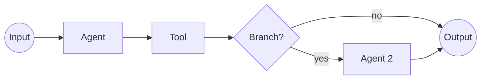

Workflows chain agents and tools into a **DAG** you can run and reuse.

## Build a Workflow
1. **New Workflow** → fill **Name/Description/Policy**.  
2. Open **Canvas** → add **Agent**, **Tool**, **Branch** nodes; connect edges.  
3. Save.

**API**  
> **Authentication**  
> All API calls require headers:  
> ```http
> X-API-Key: <your_key>
> Authorization: Bearer <your_token>
> ```

- `POST /api/workflows`  
```json
{ "name":"Bug Triage","policy_id":"support_policy","graph":{"nodes":[...],"edges":[...]} }
```

## Run & Monitor
Click **Run**, pass inputs (JSON), watch spans in **Runs**.

**API**  
- `POST /api/workflows/{id}/run` → `{"run_id":"run_123"}`  
- `GET /api/runs?workflow_id={id}&limit=50`

## Promote a Run
Convert a successful trace into a workflow template.

**API (optional)**  
`POST /api/workflows/promote` → `{"workflow_id":"wf_new"}`

## Diagram

